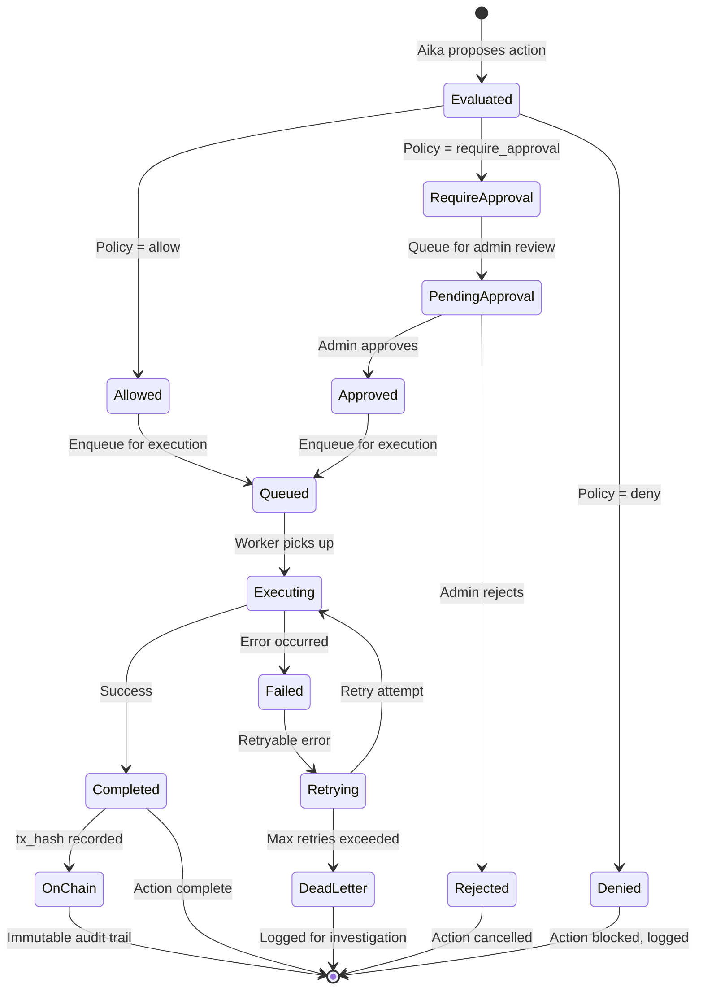
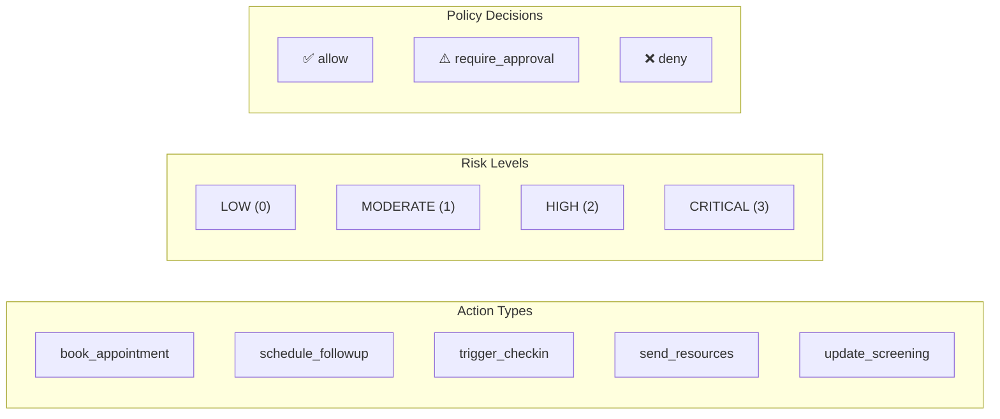
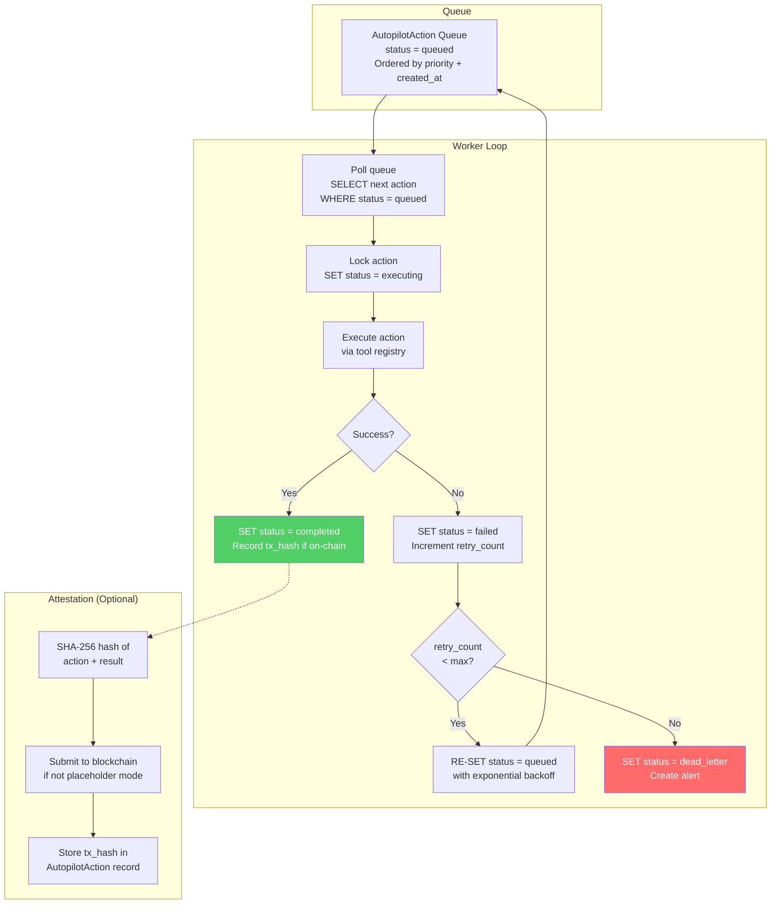
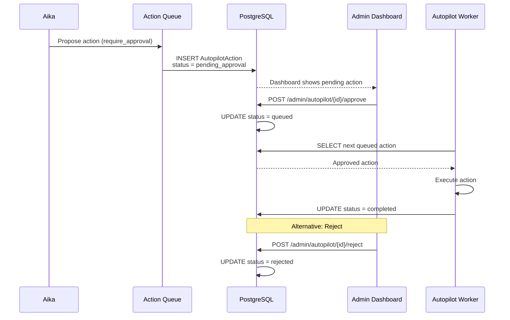

# Autopilot Architecture

The Aika Autopilot system enables policy-governed autonomous actions, allowing Aika to perform operational tasks (appointment booking, follow-up scheduling, check-in triggers) without human intervention — subject to configurable safety policies.

---

## Autopilot Action Lifecycle



---

## Policy Evaluation Flow

```mermaid
flowchart TD
    ACTION["Aika proposes action<br/>e.g., book_appointment,<br/>schedule_followup,<br/>trigger_checkin"] --> META["Extract action metadata<br/>action_type, risk_level,<br/>user_id, idempotency_key"]

    META --> LOOKUP["Lookup policy matrix<br/>for (action_type, risk_level)"]
    LOOKUP --> DECISION{Policy<br/>decision}

    DECISION --> |"allow"| PRE_CHECK["Pre-execution checks<br/>1. Idempotency: already executed?<br/>2. Rate limit: not too frequent?<br/>3. User consent: action permitted?"]
    DECISION --> |"require_approval"| QUEUE["Queue for admin review<br/>Create AutopilotAction<br/>status = pending_approval<br/>Notify admin dashboard"]
    DECISION --> |"deny"| BLOCK["Block action<br/>Log denial reason<br/>Return denial message to Aika"]

    PRE_CHECK --> CHECK_OK{Checks<br/>passed?}
    CHECK_OK --> |Yes| EXECUTE["Execute action<br/>via tool registry"]
    CHECK_OK --> |No (idempotent)| SKIP["Skip: already executed<br/>Return previous result"]
    CHECK_OK --> |No (rate limit)| DELAY["Delay action<br/>Schedule for later"]
    CHECK_OK --> |No (consent)| BLOCK

    EXECUTE --> EXEC_OK{Execution<br/>succeeded?}
    EXEC_OK --> |Yes| RECORD["Record result<br/>+ optional on-chain attestation"]
    EXEC_OK --> |No| RETRY_QUEUE["Queue for retry<br/>with backoff"]

    QUEUE --> ADMIN_REVIEW["Admin reviews<br/>via /admin/autopilot"]
    ADMIN_REVIEW --> |Approve| PRE_CHECK
    ADMIN_REVIEW --> |Reject| BLOCK

    style DECISION fill:#ffd93d,color:#333
    style BLOCK fill:#ff6b6b,color:#fff
    style EXECUTE fill:#51cf66,color:#fff
```

---

## Policy Matrix

The policy matrix defines which actions are permitted at each risk level:



### Default Policy Configuration

| Action | LOW | MODERATE | HIGH | CRITICAL |
|--------|-----|----------|------|----------|
| `book_appointment` | allow | allow | require_approval | require_approval |
| `schedule_followup` | allow | allow | allow | require_approval |
| `trigger_checkin` | allow | allow | require_approval | deny |
| `send_resources` | allow | allow | allow | allow |
| `update_screening` | allow | allow | allow | require_approval |

---

## Execution Worker Architecture



---

## Idempotency

Each action includes an idempotency key computed from:

```
idempotency_key = hash(action_type + user_id + target_resource_id + time_window)
```

This prevents duplicate execution of the same logical action (e.g., double-booking an appointment) even if the proposal is made multiple times due to retries or re-processing.

---

## Admin Approval Interface



---

## Verification Surfaces

| Surface | URL/API | What It Shows |
|---------|---------|---------------|
| Admin queue | `/admin/autopilot` | All actions with status, risk level, policy decision |
| Proof timeline | `/proof` | User-facing proof of actions + on-chain attestations |
| Admin API | `GET /api/v1/admin/autopilot/actions` | Full action list with filtering |
| Approve API | `POST /api/v1/admin/autopilot/actions/{id}/approve` | Approve pending action |
| Reject API | `POST /api/v1/admin/autopilot/actions/{id}/reject` | Reject pending action |
| Proof API | `GET /api/v1/proof/actions` | User-facing action proof list |
