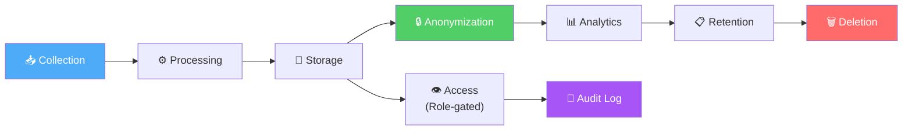
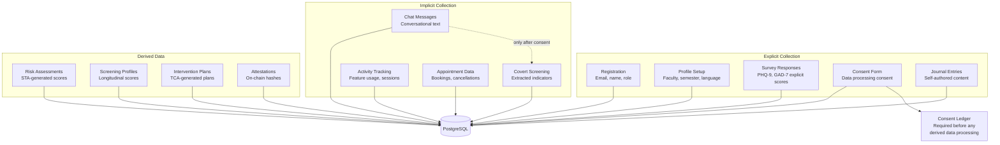
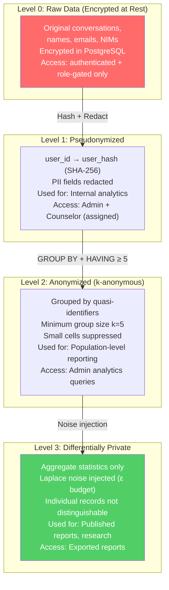
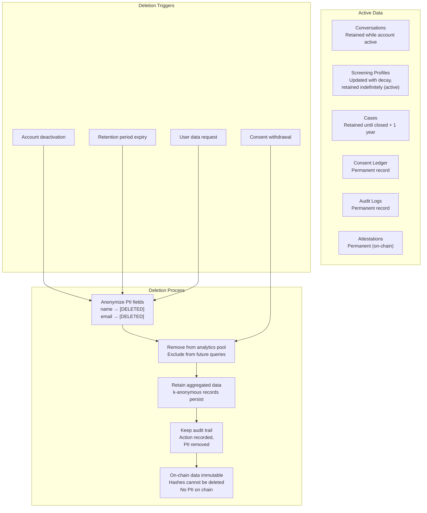

# Data Privacy Lifecycle

This document traces the complete lifecycle of personal data in UGM-AICare — from collection through processing, storage, anonymization, retention, and deletion.

---

## Data Lifecycle Overview

---

## Data Collection Points

---

## Consent Lifecycle

```mermaid
stateDiagram-v2
    [*] --> NoConsent: User registers
    NoConsent --> Pending: Shown consent form
    Pending --> Granted: User accepts
    Pending --> Declined: User declines
    Granted --> Withdrawn: User withdraws consent
    Withdrawn --> Granted: User re-grants
    Declined --> Granted: User later accepts

    state Granted {
        [*] --> ActiveProcessing
        ActiveProcessing --> AnalyticsIncluded: Data in analytics pool
        ActiveProcessing --> ScreeningActive: STA processes conversations
    }

    state Withdrawn {
        [*] --> ProcessingStopped
        ProcessingStopped --> AnonymizationQueued: Existing data anonymized
    }

    note right of Granted: All derived data processing enabled
    note right of Withdrawn: No new processing;<br/>existing data retained but<br/>excluded from analytics
```

---

## Anonymization Levels

---

## Data Retention & Deletion

---

## Privacy Controls Summary

| Control | Mechanism | Scope | Enforcement Point |
|---------|-----------|-------|-------------------|
| **PII Redaction** | Regex-based replacement | All conversation text before analytics | STA `apply_redaction_node` |
| **Pseudonymization** | SHA-256 hashing (user_id → user_hash) | Analytics data layer | IA query builder |
| **k-Anonymity** | GROUP BY + HAVING COUNT ≥ 5 | All population queries | IA `apply_k_anonymity_node` |
| **Differential Privacy** | Laplace noise injection (ε budget) | Aggregate statistics | IA post-processing |
| **Consent Enforcement** | UserConsentLedger check | All analytics processing | IA `validate_consent_node` |
| **Role-Based Access** | JWT + RBAC middleware | All API endpoints | FastAPI middleware |
| **Encryption at Rest** | PostgreSQL encryption | Database storage | Infrastructure layer |
| **Audit Logging** | UserAuditLog + LangGraphAlert | All data access events | Middleware + agent tracker |
| **On-chain Immutability** | Smart contract hashes | Attestation records | Blockchain domain |
