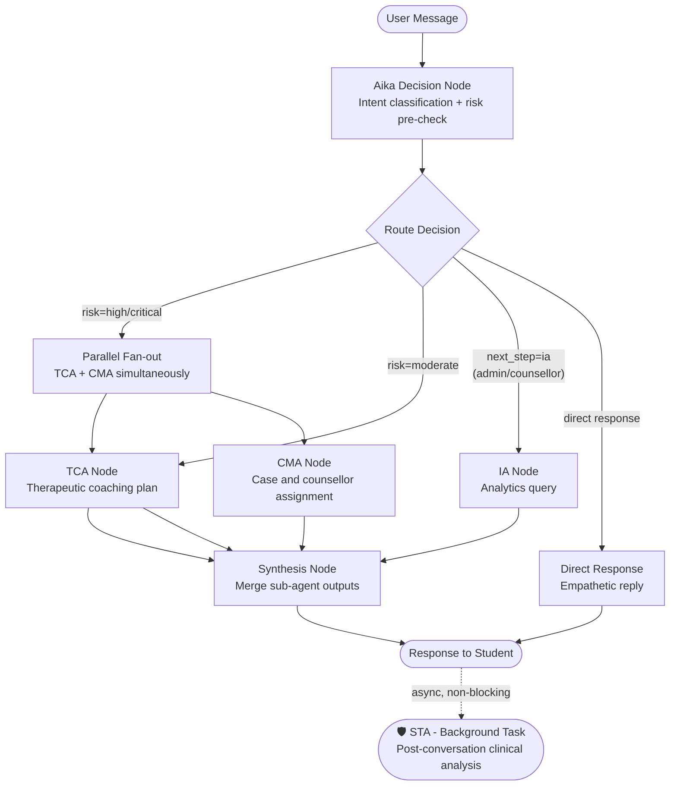
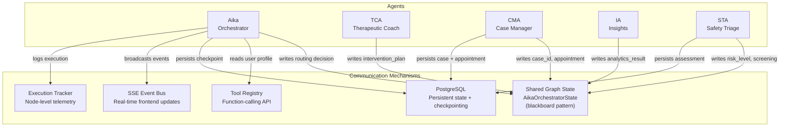
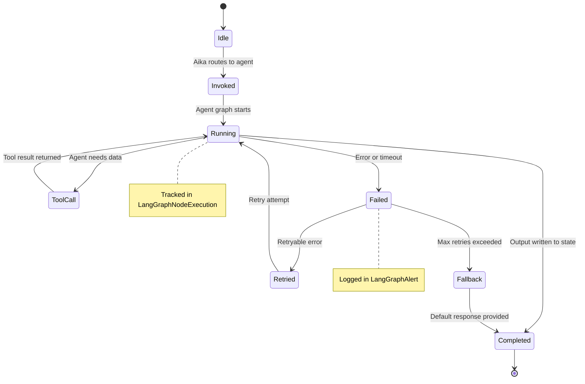
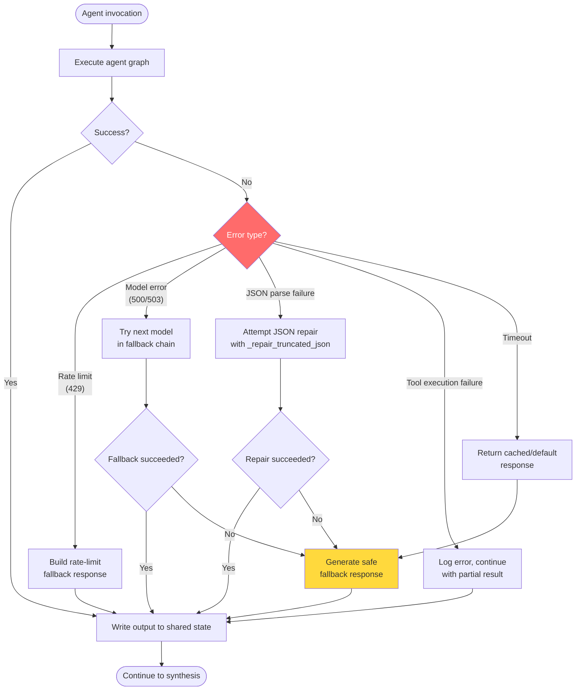

# The Agentic Framework

## Why Agents, Not a Single Model?

The system could theoretically function with a single AI model processing and responding to student messages. However, this approach is insufficient at scale. No individual model can effectively balance the roles of an empathetic peer, a clinical risk assessor, a CBT coach, and a case manager. Attempting to unify these distinct responsibilities within a single prompt often results in suboptimal performance across all domains.

The solution is the same one used in real clinical settings: **specialisation with coordination**. A general practitioner doesn't perform neurosurgery. They assess, then refer, then coordinate. UGM-AICare applies the same principle to AI.

---

## The Belief-Desire-Intention (BDI) Model

Each agent in the system is designed around the **BDI cognitive architecture**, a framework from academic agent theory that maps cleanly to how clinical decision-making works:

| BDI Component | What It Means | In UGM-AICare |
|---|---|---|
| **Belief** | What the agent *knows* about the world | User profile, conversation history, previously assessed risk level, active cases |
| **Desire** | What the agent *wants to achieve* | Ensure student safety, reduce distress, facilitate access to professional support |
| **Intention** | The *specific action* the agent decides to take | Run crisis triage → generate coping plan → open a case → schedule appointment |

This architecture ensures agent behavior remains predictable, auditable, and testable, which is critical in clinical contexts.

---

## The LangGraph Orchestration Graph

The system uses **LangGraph**, a library built on top of LangChain, to define the agents as a directed graph. Each node in the graph is an async Python function; edges represent conditional routing decisions.



### Reading the Graph

Aika serves as the primary router, classifying intent and performing a rapid keyword check for crisis signals. High or critical risk levels initiate a parallel fan-out where the TCA and CMA nodes run concurrently, providing a comprehensive response more efficiently. Moderate risk scenarios route exclusively to the TCA for coaching support without initiating a formal clinical case. Analytics requests from counselors or administrators are directed to the IA node. For low-risk or casual interactions, Aika provides a direct empathetic response without involving sub-agents. The STA operates outside the real-time graph as a non-blocking background task triggered after the conversation to prevent added latency for the user.

Key workflow decisions:
- **High/Critical risk** triggers a **parallel fan-out** - TCA and CMA run concurrently (`asyncio.gather`) so the student gets a complete response faster.
- **Moderate risk** routes to TCA only - deep coaching support without opening a formal clinical case.
- **Analytics requests** (classified as `analytics_query`, counsellor/admin roles) reach the IA node.
- **Low risk / casual conversation** returns a direct empathetic reply from Aika without invoking sub-agents via a ReAct tool loop.
- **STA** is deliberately *outside* the real-time graph. It is triggered as a non-blocking background task (`trigger_sta_conversation_analysis_background`) after the conversation, so it never adds latency to the student's experience.

---

## State Management, Storage, and Caching

The multi-agent system uses specialized persistence layers to maintain state without compromising performance.

### 1. LangGraph Memory (`AsyncPostgresSaver`)
All conversational state for the orchestrator is durably saved in **PostgreSQL**. Aika utilizes LangGraph's native `AsyncPostgresSaver` checkpointer. This allows the graph to persist long-running sessions, retrieve exact thread contexts across server restarts, and enables future capabilities like human-in-the-loop interventions where the graph can "pause" and wait for a counselor's approval before resuming.

### 2. The Singleton Compiler
To avoid the high overhead of compiling the LangGraph workflow and binding database sessions on every HTTP request, the graph is compiled exactly once during the FastAPI lifespan (`_compiled_agent`). Subsequent requests retrieve the cached agent and pass the state directly.

### 3. Redis Caching
While PostgreSQL acts as the primary checkpointer, high-speed ephemeral data is managed by **Redis**:
- **Operational Cache:** Short-lived keys for runtime coordination and performance-sensitive lookups.
- **Rate Limiting & Triage:** Prevents API abuse and ensures stability.
- **Session Tracking:** Fast retrieval of ongoing session statuses.

---

## Shared Graph State

All agents communicate through a shared `AikaOrchestratorState` object (which extends `SafetyAgentState`) - a typed dictionary that flows through the graph. No agent calls another agent directly; they read from and write to this shared state.

```python
# Simplified view of what the state carries
class SafetyAgentState(TypedDict):
 # Input context
 user_id: int
 message: str
 conversation_id: int

 # STA outputs
 risk_level: int # 0=low, 1=moderate, 2=high, 3=critical
 risk_score: float # 0.0 – 1.0
 severity: str # "low" | "moderate" | "high" | "critical"
 intent: str # "casual_chat" | "crisis" | "academic_stress" …

 # TCA outputs
 intervention_plan: dict
 coping_strategies: list[str]

 # CMA outputs
 case_id: Optional[int]
 counsellor_id: Optional[int]
 appointment_scheduled: bool

 # Final
 final_response: str
```

This design means any agent can be replaced, upgraded, or tested independently - as long as it reads and writes the same fields, the rest of the graph is unaffected.

---

## Tool Calling

Aika and each sub-agent have access to a set of **tools** - functions they can invoke to fetch or modify real data. Tools are defined once in a central registry and exposed to agents via Gemini's function-calling API.

Tool access is role-scoped: a student's Aika instance can call `book_appointment` and `get_crisis_resources`, but cannot call `get_active_safety_cases` - that tool is only available to counsellor and admin roles.

```
Student Aika Tools:
 get_user_profile get_journal_entries get_activity_streak
 create_intervention_plan get_available_counselors
 suggest_appointment_times book_appointment cancel_appointment
 reschedule_appointment get_crisis_resources

Counsellor Aika Tools:
 get_case_details get_conversation_summary
 get_risk_assessment_history trigger_conversation_analysis
 get_active_safety_cases get_escalation_protocol

Admin Aika Tools:
 All counsellor tools + get_conversation_stats + search_conversations
```

---

## The STA's Two-Tier Analysis

The Safety Triage Agent runs at two different times with two different depths:

### Tier 1 - Real-time (inside the conversation, < 5 ms)
A fast regex check against a predefined list of crisis keywords (`"bunuh diri"`, `"kill myself"`, `"end my life"`, etc.). If any keyword matches, the risk level is immediately elevated to `HIGH` before any LLM call is made. This ensures zero latency on the most critical signal.

### Tier 2 - Post-conversation background analysis (async, 2–10 s)
After the conversation ends, the STA performs a deep clinical analysis using Gemini:
- PHQ-9, GAD-7, and DASS-21 indicator extraction (covert screening)
- Longitudinal risk trend across the student's conversation history
- Psychologist-ready summary report
- CMA referral recommendation

The results are stored in `ConversationRiskAssessment` and `ScreeningProfile` tables, visible to counsellors via the dashboard.

---

## Agent Communication Patterns

Agents do not call each other directly. All communication flows through the shared `AikaOrchestratorState`, which acts as a blackboard pattern.



---

## Agent State Lifecycle

Each agent invocation follows a predictable lifecycle tracked by the execution tracker.



---

## Error Handling & Fallback Strategy



Every agent has a fallback path that ensures the system never leaves a student without a response, even when LLM providers experience outages.

---

## Why This Design Avoids Common AI Pitfalls

| Common Problem | How This System Addresses It |
|---|---|
| **Hallucinated appointments** | CMA calls real database functions - appointment slots come from actual counsellor availability, not from the model's imagination |
| **Inconsistent responses at scale** | Deterministic routing guards (e.g., crisis keyword match) run before any LLM call, ensuring predictable behaviour on safety-critical paths |
| **Opaque AI decisions** | Langfuse traces every agent node invocation, every tool call, and every LLM prompt - full auditability |
| **Privacy leakage in analytics** | IA queries enforce k-anonymity at the query layer; PII is redacted before any data enters the analytics pipeline |
| **Single point of failure** | Sub-agents are invoked asynchronously. If TCA fails, CMA can still respond independently |
| **LLM provider outage** | Multi-key rotation, model fallback chains, and circuit breaker prevent single-provider dependency |
| **Runaway tool loops** | Per-intent iteration caps prevent infinite tool-calling cycles |
