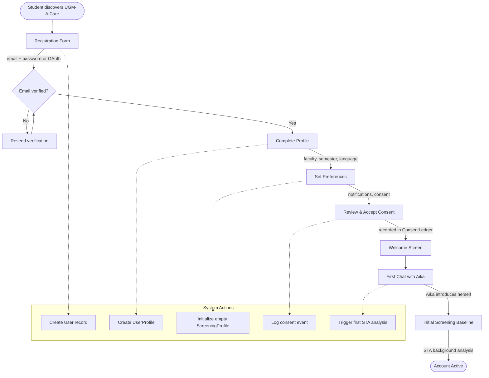
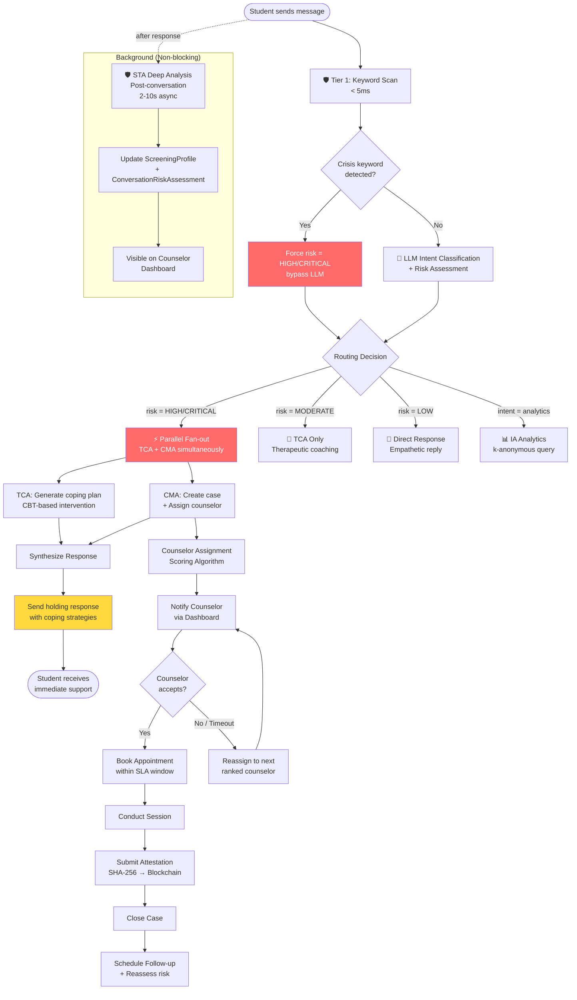
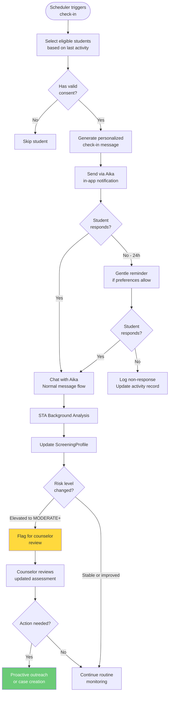
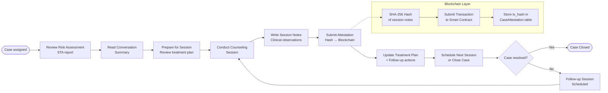
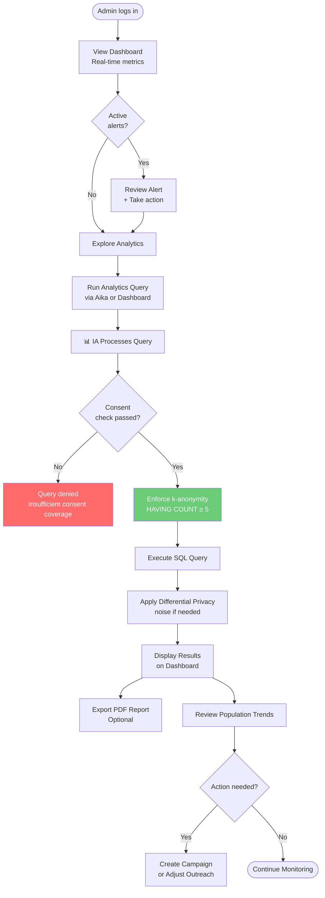
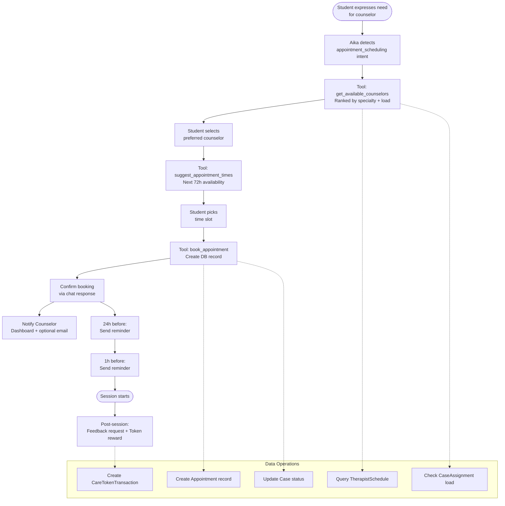

# Business Process Flows

This document maps the core operational processes of UGM-AICare from trigger to completion, showing how system agents, human actors, and external services coordinate.

---

## 1. Student Onboarding

The onboarding process creates all necessary records and establishes an initial screening baseline through the student's first conversation. The consent ledger entry at this stage is the foundation for all subsequent data processing — no analytics or screening data is generated without a valid consent record.

---

## 2. Crisis Intervention Workflow

This is the highest-priority business process in the system. When a student expresses distress, the system must respond within seconds while simultaneously initiating human escalation.

### SLA Targets

| Risk Level | Target Time to First Counselor Contact | Escalation if Breached |
|------------|---------------------------------------|----------------------|
| CRITICAL | 4 hours | Admin alert + auto-reassignment |
| HIGH | 24 hours | Admin alert after 12 hours |
| MODERATE | 72 hours | Admin alert after 48 hours |
| LOW (student-initiated) | 5 business days | No escalation |

---

## 3. Routine Check-in Flow

---

## 4. Counselor Case Handling

---

## 5. Admin Analytics Review

---

## 6. Appointment Booking Flow

