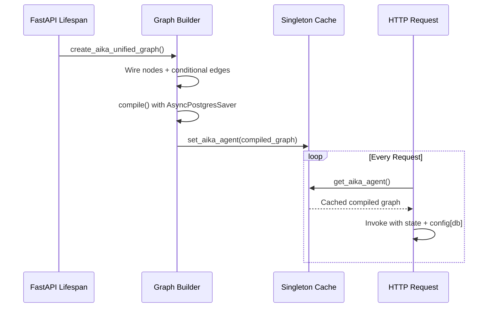

# Component Architecture

This document maps the internal component structure of UGM-AICare, showing how frontend modules, backend services, agent subsystems, and infrastructure components communicate.

---

## High-Level Component Diagram

```mermaid
graph TB
    subgraph "Presentation Layer"
        subgraph "Next.js Frontend"
            CHAT["Chat Interface<br/>SSE Streaming"]
            DASH_S["Student Dashboard<br/>Journal, Activities, Tokens"]
            DASH_C["Counselor Portal<br/>Cases, Patients, Schedule"]
            DASH_A["Admin Console<br/>Analytics, Config, Audit"]
            AUTH_FE["NextAuth.js<br/>Session Management"]
            WEB3["Web3 Provider<br/>Wallet Connection"]
        end
    end

    subgraph "Application Layer"
        subgraph "FastAPI Backend"
            API_GATEWAY["API Gateway<br/>CORS, Auth, Rate Limiting"]
            MW["Middleware Stack<br/>RequestContext, Activity, Performance"]
            METRICS["Prometheus Metrics<br/>/metrics endpoint"]
        end

        subgraph "Mental Health Domain"
            CHAT_SVC["Chat Service<br/>Message handling, SSE broadcast"]
            CASE_SVC["Case Service<br/>Case lifecycle, SLA tracking"]
            APT_SVC["Appointment Service<br/>Booking, scheduling"]
            JOURNAL_SVC["Journal Service<br/>Entries, prompts"]
            SCREENING_SVC["Screening Service<br/>Profile management, scoring"]
            QUEST_SVC["Quest Service<br/>Gamification, rewards"]
            SURVEY_SVC["Survey Service<br/>Explicit assessments"]
        end

        subgraph "Auth & User Domain"
            AUTH_SVC["Auth Service<br/>JWT, OAuth, DID"]
            PROFILE_SVC["Profile Service<br/>User data, preferences"]
        end
    end

    subgraph "Agent Layer"
        subgraph "Aika Orchestrator"
            DECISION["Decision Node<br/>Intent + Risk classification"]
            SYNTH["Synthesis Node<br/>Response merging"]
            TOOL_LOOP["Tool-Calling Loop<br/>ReAct pattern"]
            SCREENING_AW["Screening Awareness<br/>Gap analysis + probing"]
            AUTOPILOT["Autopilot Worker<br/>Policy evaluation + execution"]
        end

        subgraph "STA — Safety Triage"
            STA_INGEST["Ingest Node"]
            STA_REDACT["PII Redaction Node"]
            STA_ASSESS["Risk Assessment Node<br/>Keyword + LLM"]
            STA_ROUTE["Routing Decision"]
            STA_CONV["Conversation Analyzer<br/>Deep post-conversation analysis"]
        end

        subgraph "TCA — Therapeutic Coach"
            TCA_GRAPH["TCA Graph<br/>Plan generation"]
            TCA_PLAN["Gemini Plan Generator<br/>CBT prompt templates"]
            TCA_SAFETY["Safety Review Gate"]
            TCA_ACTIVITIES["Activity Catalog<br/>Wellness resources"]
        end

        subgraph "CMA — Case Management"
            CMA_GRAPH["CMA Graph<br/>Case workflow"]
            CMA_ASSIGN["Assignment Algorithm<br/>Counselor scoring"]
            CMA_SLA["SLA Enforcement<br/>Deadline tracking"]
        end

        subgraph "IA — Insights Agent"
            IA_GRAPH["IA Graph<br/>Privacy pipeline"]
            IA_CONSENT["Consent Validation"]
            IA_KANON["k-Anonymity Enforcement"]
            IA_INTERPRET["LLM Interpreter<br/>Natural language results"]
            IA_PDF["PDF Report Generator"]
        end

        subgraph "Shared Infrastructure"
            TOOL_REG["Tool Registry<br/>@register_tool decorator"]
            LLM_DISPATCH["LLM Dispatch<br/>Gemini + Fallback chains"]
            EXEC_TRACK["Execution Tracker<br/>LangGraph telemetry"]
            CHECKPOINTER["Postgres Checkpointer<br/>AsyncPostgresSaver"]
        end
    end

    subgraph "Blockchain Domain"
        CARE["CARE Token Client<br/>SOMNIA Chain"]
        NFT["NFT Client<br/>EDU Chain / BNB"]
        ATTEST["Attestation Client<br/>Multi-chain"]
        STAKING["Staking Client<br/>Token staking"]
    end

    subgraph "Infrastructure Layer"
        PG[("PostgreSQL<br/>Primary data store<br/>+ LangGraph checkpointing")]
        REDIS[("Redis<br/>Cache + Rate limiting<br/>+ Session tracking")]
        S3[("Object Storage<br/>Avatars, media")]
        SCHEDULER["APScheduler<br/>Background jobs"]
    end

    CHAT --> API_GATEWAY
    DASH_S --> API_GATEWAY
    DASH_C --> API_GATEWAY
    DASH_A --> API_GATEWAY
    AUTH_FE --> API_GATEWAY

    API_GATEWAY --> MW --> METRICS

    API_GATEWAY --> CHAT_SVC
    API_GATEWAY --> CASE_SVC
    API_GATEWAY --> APT_SVC
    API_GATEWAY --> JOURNAL_SVC
    API_GATEWAY --> SCREENING_SVC
    API_GATEWAY --> AUTH_SVC
    API_GATEWAY --> PROFILE_SVC
    API_GATEWAY --> QUEST_SVC
    API_GATEWAY --> SURVEY_SVC

    CHAT_SVC --> DECISION
    DECISION --> SYNTH
    DECISION --> TOOL_LOOP
    DECISION --> SCREENING_AW
    DECISION --> AUTOPILOT

    DECISION --> STA_INGEST
    STA_INGEST --> STA_REDACT --> STA_ASSESS --> STA_ROUTE
    STA_CONV --> SCREENING_SVC

    DECISION --> TCA_GRAPH
    TCA_GRAPH --> TCA_PLAN & TCA_SAFETY & TCA_ACTIVITIES

    DECISION --> CMA_GRAPH
    CMA_GRAPH --> CMA_ASSIGN & CMA_SLA
    CMA_ASSIGN --> CASE_SVC & APT_SVC

    DECISION --> IA_GRAPH
    IA_GRAPH --> IA_CONSENT --> IA_KANON --> IA_INTERPRET --> IA_PDF

    TOOL_LOOP --> TOOL_REG
    DECISION --> LLM_DISPATCH
    STA_ASSESS --> LLM_DISPATCH
    TCA_PLAN --> LLM_DISPATCH
    IA_INTERPRET --> LLM_DISPATCH

    CHAT_SVC --> CHECKPOINTER
    CHAT_SVC --> EXEC_TRACK

    CASE_SVC --> CARE & ATTEST
    QUEST_SVC --> NFT & CARE

    API_GATEWAY --> PG
    CHAT_SVC --> PG
    API_GATEWAY --> REDIS
    API_GATEWAY --> S3
    MW --> SCHEDULER

    style DECISION fill:#ffd93d,color:#333
    style PG fill:#336791,color:#fff
    style REDIS fill:#dc382d,color:#fff
```



---

## Backend Package Structure

```
backend/
├── app/
│   ├── main.py                          # FastAPI app, lifespan, router registration
│   ├── config.py                        # Pydantic BaseSettings (env-backed)
│   ├── startup.py                       # Shared bootstrap logic
│   ├── auth_utils.py                    # JWT helpers, role verification
│   │
│   ├── agents/                          # LangGraph Agent Implementations
│   │   ├── graph_state.py              # AikaOrchestratorState + agent states
│   │   ├── aika_orchestrator_graph.py   # Graph assembly + singleton cache
│   │   ├── aika/                        # Aika Meta-Agent
│   │   │   ├── decision_node.py         # Intent classification + risk routing
│   │   │   ├── subgraph_nodes.py        # TCA/CMA/IA/STA execution wrappers
│   │   │   ├── background_tasks.py      # STA trigger + screening update
│   │   │   ├── prompt_builder.py        # Context assembly for LLM
│   │   │   ├── message_classifier.py    # Small-talk detection
│   │   │   ├── identity.py              # Persona system prompt builder
│   │   │   ├── activity_logger.py       # SSE event broadcasting
│   │   │   ├── screening_awareness.py   # Gap analysis + probing
│   │   │   ├── tools.py                 # Aika-specific tool definitions
│   │   │   ├── constants.py             # Shared constants
│   │   │   └── routing.py               # Route computation helpers
│   │   ├── sta/                         # Safety Triage Agent
│   │   │   ├── sta_graph.py             # STA state machine
│   │   │   ├── service.py               # STA service wrapper
│   │   │   ├── gemini_classifier.py     # Gemini-based risk classifier
│   │   │   ├── classifiers.py           # Rule-based classifiers
│   │   │   └── conversation_analyzer.py # Deep post-conversation analysis
│   │   ├── tca/                         # Therapeutic Coach Agent
│   │   │   ├── tca_graph.py             # TCA LangGraph
│   │   │   ├── tca_graph_service.py     # TCA service wrapper
│   │   │   ├── gemini_plan_generator.py # CBT prompt templates + plan gen
│   │   │   ├── service.py               # TCA fallback orchestration
│   │   │   ├── activities_catalog.py    # Wellness activity library
│   │   │   ├── resources.py             # Default resource cards
│   │   │   └── schemas.py               # Request/response DTOs
│   │   ├── cma/                         # Case Management Agent
│   │   │   ├── cma_graph.py             # CMA LangGraph
│   │   │   ├── cma_graph_service.py     # CMA service wrapper
│   │   │   ├── service.py               # Case CRUD + assignment
│   │   │   ├── sla.py                   # SLA deadline computation
│   │   │   └── schemas.py               # Request/response DTOs
│   │   ├── ia/                          # Insights Agent
│   │   │   ├── ia_graph.py              # IA privacy-preserving pipeline
│   │   │   ├── ia_graph_service.py      # IA service wrapper
│   │   │   ├── service.py               # Analytics orchestration
│   │   │   ├── llm_interpreter.py       # LLM-based result interpretation
│   │   │   ├── queries.py               # Allow-listed query definitions
│   │   │   ├── pdf_generator.py         # PDF report generation
│   │   │   └── schemas.py               # Request/response DTOs
│   │   └── shared/                      # Shared Agent Infrastructure
│   │       └── tools/
│   │           ├── registry.py          # @register_tool + schema generation
│   │           └── __init__.py          # Tool exports
│   │
│   ├── core/                            # Cross-cutting Infrastructure
│   │   ├── llm.py                       # LLM dispatch + fallback + circuit breaker
│   │   └── ...                          # Auth, cache, scheduler, redaction, memory
│   │
│   ├── domains/
│   │   ├── mental_health/               # Primary business domain
│   │   │   ├── routes/                  # API route modules
│   │   │   │   ├── chat.py             # Chat endpoint + SSE streaming
│   │   │   │   ├── agents_graph.py     # Agent graph execution endpoint
│   │   │   │   ├── aika_stream.py      # Aika SSE streaming endpoint
│   │   │   │   ├── safety_triage.py    # STA manual trigger endpoint
│   │   │   │   ├── appointments.py     # Appointment CRUD
│   │   │   │   ├── counselor.py        # Counselor-specific endpoints
│   │   │   │   ├── journal.py          # Journal entry endpoints
│   │   │   │   ├── quests.py           # Quest endpoints
│   │   │   │   ├── surveys.py          # Survey endpoints
│   │   │   │   └── ...                 # feedback, session_events, etc.
│   │   │   ├── screening/              # Screening engine
│   │   │   │   ├── instruments.py      # Instrument definitions + thresholds
│   │   │   │   └── engine.py           # Profile update logic
│   │   │   └── services/               # Domain services
│   │   ├── blockchain/                  # Blockchain integration
│   │   │   ├── clients/                # Web3 clients
│   │   │   └── routes/                 # Blockchain API routes
│   │   └── finance/                     # Revenue + token economics
│   │
│   ├── models/                          # SQLAlchemy ORM Models
│   │   ├── user.py                      # User entity
│   │   ├── user_profile.py             # UserProfile
│   │   ├── user_session.py             # UserSession
│   │   ├── user_consent_ledger.py      # Consent tracking
│   │   ├── user_audit_log.py           # Audit trail
│   │   ├── user_ai_memory_fact.py      # AI memory
│   │   ├── user_activity.py            # Activity tracking
│   │   ├── langgraph_tracking.py       # Agent execution tracking
│   │   ├── badges.py                   # Badge templates + issuances
│   │   ├── campaign.py                 # Campaigns + metrics
│   │   ├── alerts.py                   # System alerts
│   │   ├── insights.py                 # Analytics reports
│   │   └── ...                         # scheduling, system, social, agent_user
│   │
│   ├── routes/                          # Top-level API Routes
│   │   ├── auth.py                      # Authentication endpoints
│   │   ├── profile.py                  # Profile management
│   │   ├── proof.py                    # Blockchain proof
│   │   ├── link_did.py                 # DID wallet linking
│   │   ├── link_ocid.py               # Open Campus ID linking
│   │   ├── care_token.py              # CARE token API
│   │   ├── revenue.py                 # Revenue reporting
│   │   ├── twitter.py                 # Twitter integration
│   │   ├── system.py                  # System health
│   │   ├── internal.py                # Internal APIs
│   │   └── admin/                     # Admin route modules
│   │       ├── dashboard.py
│   │       ├── users.py
│   │       ├── autopilot.py
│   │       ├── analytics.py
│   │       ├── screening.py
│   │       ├── insights.py
│   │       ├── agent_decisions.py
│   │       ├── attestations.py
│   │       └── ...                    # 20+ admin route modules
│   │
│   ├── shared/                          # Shared utilities
│   └── utils/                           # Helper functions
│       ├── security_utils.py
│       ├── email_utils.py
│       ├── password_reset.py
│       └── env_check.py
│
├── tests/                               # Test suite
├── scripts/                             # DB seeding, migrations, tools
└── research_evaluation/                 # Research evaluation framework
```

---

## Communication Protocols

| From → To | Protocol | Purpose |
|-----------|----------|---------|
| Frontend → Backend | REST (HTTPS) | All CRUD operations, auth |
| Frontend → Backend | SSE (HTTPS) | Chat response streaming |
| Backend → Gemini API | REST (HTTPS) | LLM inference calls |
| Backend → PostgreSQL | Async SQL (TCP) | Data persistence, LangGraph checkpointing |
| Backend → Redis | Async Redis (TCP) | Caching, rate limiting, session tracking |
| Backend → Ethereum | JSON-RPC (HTTPS) | Smart contract calls, attestation |
| Backend → Frontend | SSE push | Real-time activity events |
| Agents → Tool Registry | Python function call | Tool execution |
| Aika → TCA/CMA/IA | LangGraph state passing | Sub-agent invocation |
| Aika → STA | Background task (asyncio) | Post-conversation analysis |
| Scheduler → Backend | In-process (APScheduler) | Cron-like background jobs |

---

## Singleton Pattern

The Aika graph is compiled exactly once during FastAPI startup and reused for all requests:


