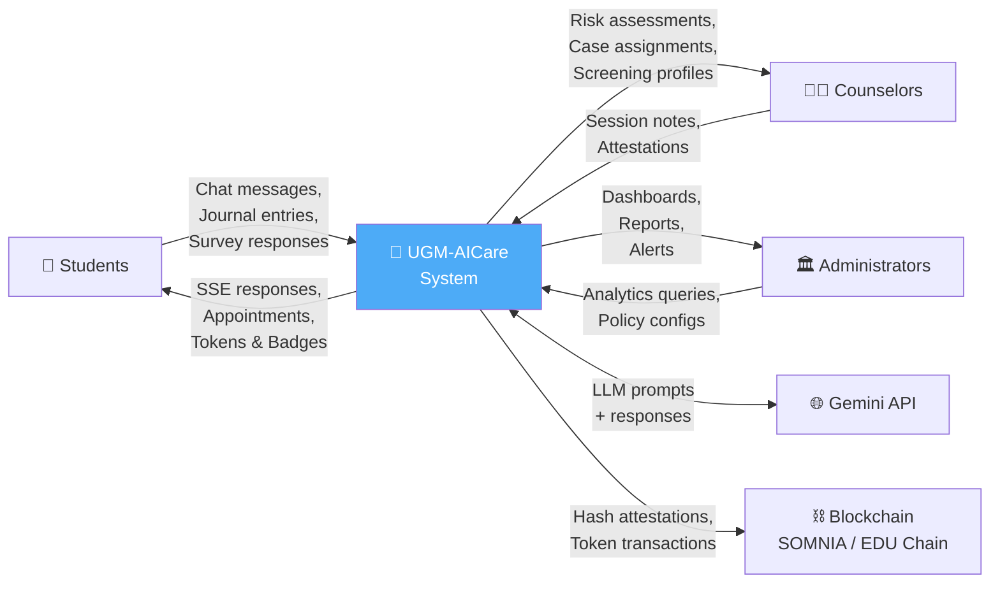
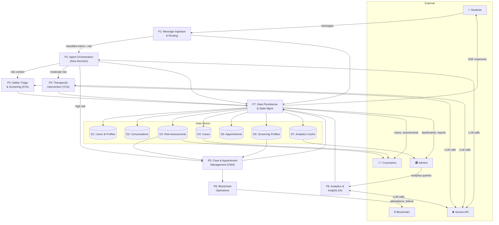
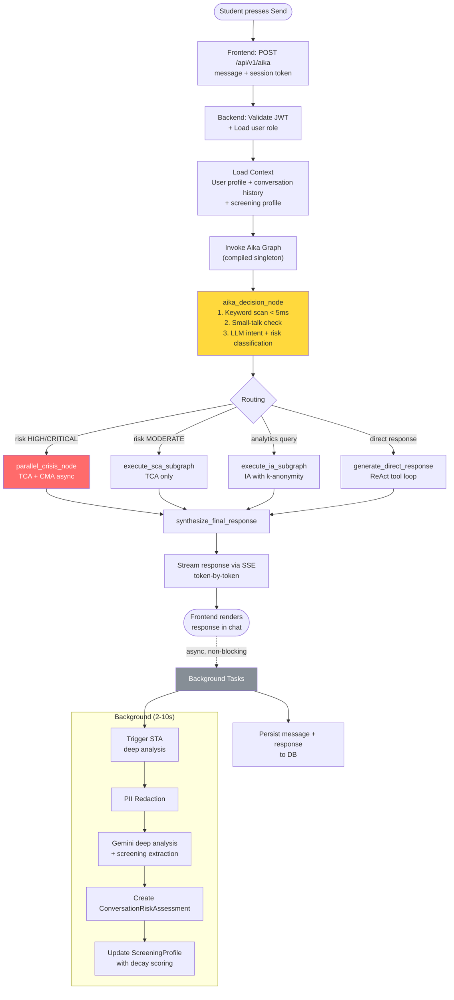
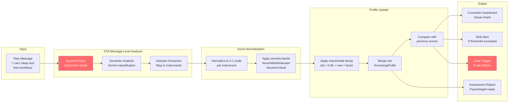
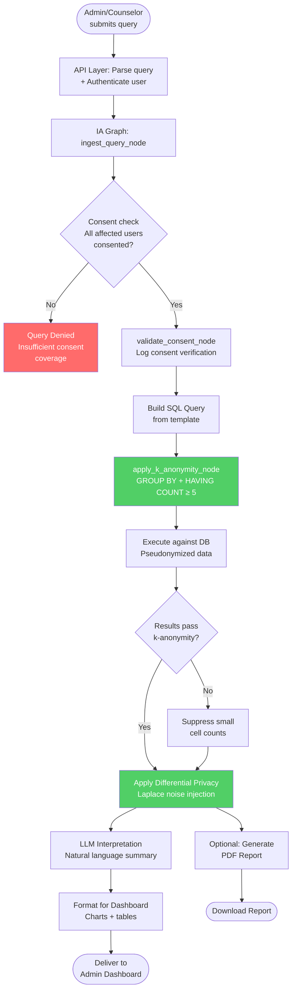
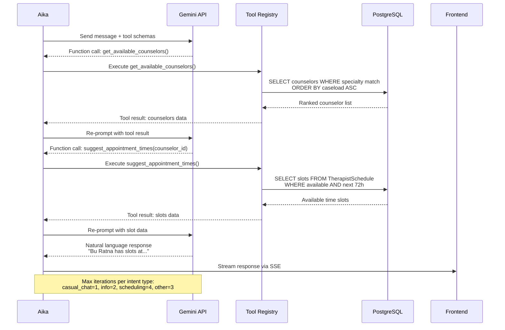

# Data Flow Diagrams

This document traces how data enters, transforms, persists, and exits the UGM-AICare system using structured Data Flow Diagrams (DFD).

---

## Level 0 — Context Diagram

The context diagram shows the system as a single process with all external entities and major data flows.

---

## Level 1 — Process Decomposition

The system decomposes into eight major processes, each with defined inputs, outputs, and data stores.

---

## Chat Message Data Flow

Detailed trace of a single message from the student pressing "send" to receiving Aika's response.

---

## Screening Data Flow

How covert psychological screening data flows from raw conversation through to counselor-visible reports.

### Instrument Mapping

| Extracted Indicator | Mapped Instrument | Field in ScreeningProfile |
|--------------------|--------------------|--------------------------|
| Depressed mood, anhedonia, fatigue | PHQ-9 | `phq9_score` |
| Nervousness, uncontrollable worry | GAD-7 | `gad7_score` |
| Difficulty relaxing, agitation | DASS-21 Stress | `dass21_stress` |
| Sleep disturbance, daytime dysfunction | PSQI | `psqi_score` |
| Social withdrawal, loneliness | UCLA Loneliness | `ucla_loneliness` |
| Self-worth, self-acceptance | RSES | `rsss_score` |
| Suicidal ideation, self-harm | C-SSRS | `csrss_score` |
| Academic pressure, fear of failure | SSI | `ssi_score` |

---

## Analytics Query Data Flow

How an analytics query travels through the IA with privacy enforcement at every stage.

---

## Tool Calling Data Flow

How Aika's tool-calling loop interacts with real data sources.

