# Database Schema

UGM-AICare uses PostgreSQL as its primary data store with SQLAlchemy 2.0 async ORM. This document provides the complete entity-relationship diagram and design rationale.

---

## Entity-Relationship Diagram

```mermaid
erDiagram
    User {
        int id PK
        string email UK
        string name
        string role "student, counselor, admin"
        string password_hash
        boolean is_active
        datetime created_at
        datetime updated_at
    }

    UserProfile {
        int id PK
        int user_id FK
        string avatar_url
        string bio
        string faculty
        int semester
        string language_preference
        string phone
    }

    UserSession {
        int id PK
        int user_id FK
        string token
        string ip_address
        string user_agent
        datetime expires_at
    }

    UserPreferences {
        int id PK
        int user_id FK
        json notification_settings
        string theme
        string language
    }

    UserConsentLedger {
        int id PK
        int user_id FK
        string consent_type
        boolean granted
        datetime timestamp
        string source
    }

    UserAuditLog {
        int id PK
        int user_id FK
        string action
        string resource
        datetime timestamp
        string ip_address
    }

    UserEmergencyContact {
        int id PK
        int user_id FK
        string name
        string relationship
        string phone
    }

    UserClinicalRecord {
        int id PK
        int user_id FK
        string record_type
        text content
        datetime created_at
    }

    UserAIMemoryFact {
        int id PK
        int user_id FK
        string fact_type
        text content
        float confidence
        datetime created_at
    }

    UserDailyActivity {
        int id PK
        int user_id FK
        date date
        int events_count
        boolean active
    }

    UserEvent {
        int id PK
        int user_id FK
        string event_type
        json metadata
        datetime timestamp
    }

    RetentionCohortDaily {
        int id PK
        date cohort_date
        int days_since_signup
        int active_users
        int total_users
    }

    AgentUser {
        int id PK
        string role "aika, sta, tca, cma, ia"
        string name
        text description
    }

    User ||--|| UserProfile : "has one"
    User ||--o{ UserSession : "has many"
    User ||--|| UserPreferences : "has one"
    User ||--o{ UserConsentLedger : "has many"
    User ||--o{ UserAuditLog : "has many"
    User ||--o{ UserEmergencyContact : "has many"
    User ||--o{ UserClinicalRecord : "has many"
    User ||--o{ UserAIMemoryFact : "has many"
    User ||--o{ UserDailyActivity : "has many"
    User ||--o{ UserEvent : "has many"

    Conversation {
        int id PK
        int user_id FK
        string title
        datetime started_at
        datetime ended_at
        string status "active, completed"
    }

    Message {
        int id PK
        int conversation_id FK
        string role "user, assistant, system"
        text content
        int tokens_used
        datetime created_at
    }

    ConversationRiskAssessment {
        int id PK
        int conversation_id FK
        int risk_level "0 to 3"
        float risk_score
        string severity "none, low, moderate, high, critical"
        text summary
        json instruments_extracted
        datetime created_at
    }

    ScreeningProfile {
        int id PK
        int user_id FK
        float phq9_score
        float gad7_score
        float dass21_stress
        float dass21_depression
        float dass21_anxiety
        float psqi_score
        float ucla_loneliness
        float rses_score
        float csrss_score
        float audit_score
        float ssi_score
        datetime last_updated
        float decay_factor
    }

    User ||--o{ Conversation : "has many"
    Conversation ||--o{ Message : "contains"
    Conversation ||--o| ConversationRiskAssessment : "assessed by"

    User ||--o| ScreeningProfile : "has one"

    Case {
        int id PK
        int user_id FK
        int counselor_id FK
        string status "open, assigned, appointment_scheduled, in_session, pending_attestation, closed"
        int risk_level
        int priority
        datetime sla_deadline
        datetime opened_at
        datetime closed_at
    }

    Appointment {
        int id PK
        int user_id FK
        int counselor_id FK
        int case_id FK
        datetime scheduled_at
        int duration_minutes
        string status "scheduled, confirmed, completed, cancelled, no_show"
        text notes
    }

    InterventionPlan {
        int id PK
        int user_id FK
        int conversation_id FK
        string plan_type
        json steps
        string status "active, completed, superseded"
        datetime created_at
    }

    JournalEntry {
        int id PK
        int user_id FK
        text content
        int mood_score
        string tags
        datetime created_at
    }

    JournalPrompt {
        int id PK
        string category
        text prompt_text
        string frequency
    }

    Feedback {
        int id PK
        int user_id FK
        int conversation_id FK
        int rating
        text comment
        datetime created_at
    }

    Resource {
        int id PK
        string title
        string type
        string category
        string url
        text content
        string language
        boolean is_active
    }

    User ||--o{ Case : "student cases"
    User ||--o{ Case : "counselor assigned"
    Case ||--o{ Appointment : "has many"
    User ||--o{ Appointment : "student booked"
    User ||--o{ Appointment : "counselor session"
    User ||--o{ InterventionPlan : "has many"
    Conversation ||--o{ InterventionPlan : "generated from"
    User ||--o{ JournalEntry : "writes"
    User ||--o{ Feedback : "gives"
    Conversation ||--o{ Feedback : "receives"

    TherapistSchedule {
        int id PK
        int counselor_id FK
        int day_of_week
        time start_time
        time end_time
        boolean is_available
    }

    CaseAssignment {
        int id PK
        int case_id FK
        int counselor_id FK
        float assignment_score
        datetime assigned_at
    }

    User ||--o{ TherapistSchedule : "counselor schedule"
    Case ||--o{ CaseAssignment : "assignment history"

    CaseAttestation {
        int id PK
        int case_id FK
        int counselor_id FK
        string content_hash
        string tx_hash
        int chain_id
        int block_number
        datetime submitted_at
    }

    BadgeTemplate {
        int id PK
        string name
        text description
        string image_url
        json criteria
        int chain_id
        string contract_address
        string status "draft, active, deprecated"
    }

    BadgeIssuance {
        int id PK
        int badge_template_id FK
        int user_id FK
        int token_id
        string tx_hash
        int chain_id
        datetime issued_at
        string status "pending, minted, failed"
    }

    Case ||--o| CaseAttestation : "attested"
    User ||--o{ CaseAttestation : "counselor submits"
    BadgeTemplate ||--o{ BadgeIssuance : "issued as"
    User ||--o{ BadgeIssuance : "earned by"

    InsightsReport {
        int id PK
        int generated_by FK
        string report_type
        json parameters
        json results
        boolean k_anonymity_enforced
        datetime created_at
    }

    Campaign {
        int id PK
        string name
        string type
        string target_audience
        string status "draft, active, paused, completed"
        string trigger_type
        text content
        datetime started_at
        datetime ended_at
    }

    CampaignMetrics {
        int id PK
        int campaign_id FK
        int sent_count
        int open_count
        int response_count
        int conversion_count
    }

    User ||--o{ InsightsReport : "generates"
    Campaign ||--o| CampaignMetrics : "measured by"

    Quest {
        int id PK
        string title
        text description
        string quest_type
        int xp_reward
        int token_reward
        boolean is_active
    }

    QuestCompletion {
        int id PK
        int quest_id FK
        int user_id FK
        datetime completed_at
        text evidence
    }

    Quest ||--o{ QuestCompletion : "completed as"
    User ||--o{ QuestCompletion : "completed by"

    LangGraphExecution {
        int id PK
        string thread_id
        string graph_name
        string status "running, completed, failed"
        datetime started_at
        datetime completed_at
        int total_tokens
    }

    LangGraphNodeExecution {
        int id PK
        int execution_id FK
        string node_name
        string agent_role
        int input_tokens
        int output_tokens
        int latency_ms
        string status
        text error_message
    }

    LangGraphEdgeExecution {
        int id PK
        int execution_id FK
        string from_node
        string to_node
        string condition
        datetime timestamp
    }

    LangGraphPerformanceMetric {
        int id PK
        string graph_name
        string node_name
        int avg_latency_ms
        int p95_latency_ms
        float success_rate
        int sample_size
        datetime measured_at
    }

    LangGraphAlert {
        int id PK
        int execution_id FK
        string alert_type
        string severity
        text message
        datetime created_at
    }

    LangGraphExecution ||--o{ LangGraphNodeExecution : "contains"
    LangGraphExecution ||--o{ LangGraphEdgeExecution : "traverses"
    LangGraphExecution ||--o{ LangGraphAlert : "raises"

    AutopilotAction {
        int id PK
        int user_id FK
        string action_type
        int risk_level
        string policy_decision "allow, require_approval, deny"
        string status "queued, approved, executed, failed, rejected"
        string tx_hash
        datetime created_at
        datetime executed_at
    }

    Alert {
        int id PK
        string type
        string severity
        text message
        string target_role
        boolean is_read
        datetime created_at
    }

    SystemSettings {
        int id PK
        string key UK
        string value
        datetime updated_at
    }

    AgentHealthLog {
        int id PK
        string agent_role
        string status
        int latency_ms
        text error_message
        datetime timestamp
    }

    FlaggedSession {
        int id PK
        int conversation_id FK
        string flag_reason
        int reviewed_by FK
        datetime reviewed_at
    }

    User ||--o{ AutopilotAction : "triggers"
    Conversation ||--o{ FlaggedSession : "flagged as"
```



---

## Relationship Cardinality Summary

| Relationship | Cardinality | Description |
|-------------|-------------|-------------|
| User → UserProfile | 1:1 | Every user has exactly one profile |
| User → UserSession | 1:N | A user can have multiple active sessions |
| User → ScreeningProfile | 1:1 | One longitudinal screening profile per student |
| User → Conversation | 1:N | A student has many conversations |
| Conversation → Message | 1:N | Each conversation contains multiple messages |
| Conversation → ConversationRiskAssessment | 1:0..1 | Background STA creates one assessment per conversation |
| User → Case | 1:N (student) | A student can have multiple cases over time |
| User → Case | 1:N (counselor) | A counselor handles many cases |
| Case → Appointment | 1:N | A case may have multiple appointments |
| Case → CaseAttestation | 1:0..1 | One attestation per case upon closure |
| LangGraphExecution → NodeExecution | 1:N | Each graph run produces multiple node records |

---

## Key Design Decisions

### Privacy by Design

- **Pseudonymization:** Analytics queries use `user_hash` (SHA-256 of user ID) instead of direct user identifiers
- **PII Redaction:** The `ConversationRiskAssessment` and analytics pipelines operate on redacted text only; original message content is accessible only through authenticated API calls with role-based access
- **Consent Ledger:** Every data access event is recorded in `UserConsentLedger`; no analytics query executes without checking consent coverage
- **k-Anonymity Enforcement:** IA queries include `GROUP BY` with `HAVING COUNT >= 5` to prevent re-identification

### JSON Fields

Several columns use PostgreSQL `JSON`/`JSONB` types for flexible schema evolution:

| Table | Field | Purpose |
|-------|-------|---------|
| ConversationRiskAssessment | `instruments_extracted` | Extracted screening scores per instrument |
| InterventionPlan | `steps` | Ordered list of plan steps with descriptions |
| UserPreferences | `notification_settings` | Notification channel preferences |
| UserEvent | `metadata` | Flexible event-specific data |
| InsightsReport | `parameters` | Query parameters used |
| InsightsReport | `results` | Query result payload |
| BadgeTemplate | `criteria` | Badge earning criteria definition |
| Campaign | `target_audience` | Audience targeting rules |

### Soft Deletes & Archival

- User accounts use `is_active` flag rather than hard deletion to preserve referential integrity and audit trails
- Conversation `status` field tracks lifecycle (active → completed) rather than deletion
- Cases transition through defined states (open → closed) and are never deleted

### Longitudinal Tracking

The `ScreeningProfile` entity uses exponential decay scoring:

```
new_score = old_score × decay_factor + extracted_weight × update_factor
```

Where `decay_factor = 0.95` by default, ensuring recent indicators are weighted more heavily while maintaining longitudinal history across conversations.

### Index Strategy

| Index Target | Type | Rationale |
|-------------|------|-----------|
| `User.email` | Unique B-tree | Login lookup, OAuth matching |
| `UserSession.token` | Unique B-tree | O(1) session validation |
| `Conversation.user_id` | B-tree | Fast user conversation list |
| `Message.conversation_id` | B-tree | Message thread retrieval |
| `Case.counselor_id` + `status` | Composite B-tree | Counselor case queue |
| `Case.sla_deadline` | B-tree | SLA breach detection |
| `Appointment.scheduled_at` | B-tree | Upcoming appointment queries |
| `ScreeningProfile.user_id` | Unique B-tree | Profile lookup |
| `AutopilotAction.status` | B-tree | Queue filtering |
| `LangGraphExecution.thread_id` | B-tree | Thread state retrieval |
| `UserEvent.user_id` + `timestamp` | Composite B-tree | Activity timeline queries |
