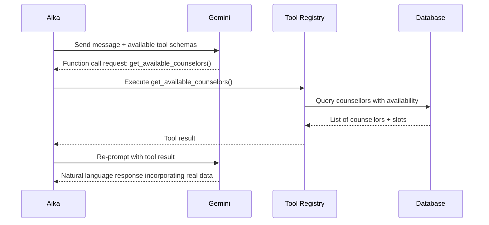
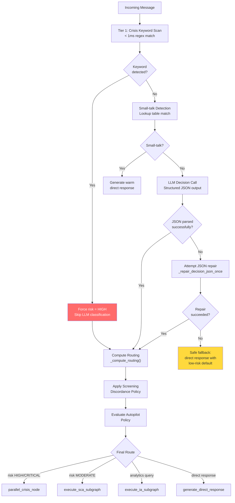
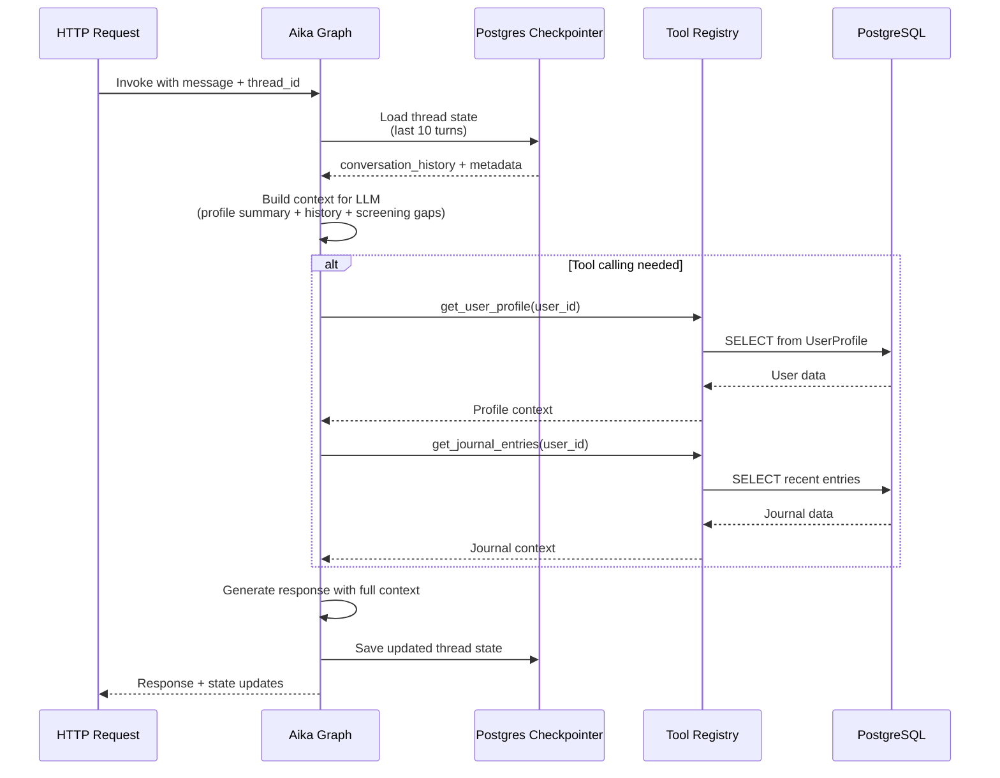
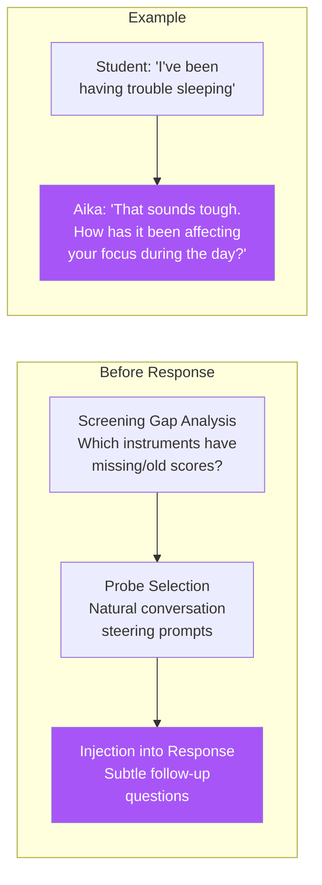

# Aika - The Orchestrator

## Who Is Aika?

**Aika** (愛佳) is the central persona of UGM-AICare. The name carries deliberate meaning:

- **愛 (Ai)** - Love, compassion
- **佳 (Ka)** - Excellence, beauty

Aika is the primary interface for student interactions. To the student, Aika appears as a supportive peer. Internally, however, Aika functions as a meta-agent orchestrator. It processes student messages, identifies necessary specialist agents, coordinates their activities, and synthesizes their outputs into a coherent response.

---

## The Three Versions of Aika

Aika presents differently depending on who is talking to it. This is not cosmetic - the underlying tool access, system prompt, and permitted operations genuinely differ.

### For Students
Aika is an empathetic companion. It uses casual Indonesian (matching the student's register), avoids clinical jargon, and gently steers towards healthy coping behaviours. When the student needs a psychologist, Aika handles the entire booking flow conversationally.

### For Counsellors
Aika is a clinical assistant. It can retrieve case summaries, pull risk assessment histories, and trigger on-demand conversation analysis (i.e., manually invoke the STA on a specific conversation). It speaks more formally and surfaces data in structured formats.

### For Administrators
Aika is a data and operations interface. Administrators can query conversation statistics, search across all conversations, view active safety cases, and pull system health data.

---

## How Aika Makes Decisions

Every message passes through three fast checks before any LLM call is made:

### Step 1 - Crisis Keyword Scan (< 1 ms)

Aika maintains a hardcoded list of crisis terms in English and Indonesian:

```
"suicide", "bunuh diri", "kill myself", "end my life",
"tidak ingin hidup lagi", "self-harm", "menyakiti diri",
"overdose", "mau mati", "ingin mati"
```

If any of these appear, the risk level is immediately set to `HIGH` before the LLM is even called. This guarantees that the system never underestimates a crisis due to an LLM miscalibration.

### Step 2 - Small Talk Detection

Common greetings, acknowledgements, and filler phrases (`"halo"`, `"ok"`, `"makasih"`, `"hahaha"`) are matched against a lookup table. Small talk skips sub-agent invocation entirely and gets a direct, warm response in a single LLM call. This saves approximately 400 ms and meaningfully reduces API costs at scale.

For everything else, Aika invokes Gemini inside the `aika_decision_node` to classify the message intent and determine the real-time risk level. This ensures that the orchestrator itself knows immediately if a crisis is occurring before delegating to sub-agents.

| Intent | What Triggers It | Routing Decision |
| --- | --- | --- |
| `casual_chat` | Venting, general sharing | Direct empathetic response |
| `crisis` | Distress, suicidal ideation | TCA + CMA parallel fan-out |
| `appointment_scheduling` | Asking about counsellors, booking | CMA tool calls |
| `academic_stress` | Exam anxiety, burnout | TCA intervention plan |
| `information_inquiry` | Asking about services | Tool call + response |
| `analytics` | Admin/counsellor data queries | IA node |

---

## Tool Calling

Aika uses Gemini's **function calling** capability to interact with real data. Rather than generating appointment times from imagination, it calls `suggest_appointment_times()` and returns actual available slots from the database.

The tool-calling loop looks like this:



The iteration budget is capped per intent type to prevent runaway tool-calling loops:

| Intent | Max Iterations | Reasoning |
| --- | --- | --- |
| `casual_chat` | 1 | No tools needed |
| `information_inquiry` | 2 | One look-up, then respond |
| `appointment_scheduling` | 4 | Get counsellors → slots → book → confirm |
| Everything else | 3 | One emotional support tool call then respond |

---

## Decision Tree Detail

The full decision flow inside `aika_decision_node`:



---

## Memory and Context Architecture



Aika maintains conversational memory through LangGraph's native checkpointer:

1. **Short-term Conversational Memory:** The state (including `conversation_history`) is durably saved via `AsyncPostgresSaver` after every graph iteration. This maintains strict continuity across the session. To cap input token costs, the history sent to the LLM is typically bounded to the last 10 turns (20 messages).
2. **Long-term Context (Database):** The student's profile, journal entries, past interventions, and screening history reside in PostgreSQL. These are not eagerly loaded - Aika uses tools like `get_user_profile()` or `get_journal_entries()` to fetch them only when relevant.

---

## Screening Awareness Injection

Aika includes a screening awareness module that identifies gaps in the student's screening profile and subtly steers conversations toward uncovering indicators.



This ensures that screening profiles are progressively enriched without the student ever feeling like they are being assessed.

---

## Screening - The Covert Layer

Aika facilitates covert mental health screening within natural conversation. It identifies clinical indicators from student messages and maps them to validated instruments, such as PHQ-9 for depression, GAD-7 for anxiety, and DASS-21 for stress. These indicators are subsequently analyzed by the STA. This conversational approach to screening is designed to minimize dropout rates and reduce the stigma associated with formal psychological assessments.

