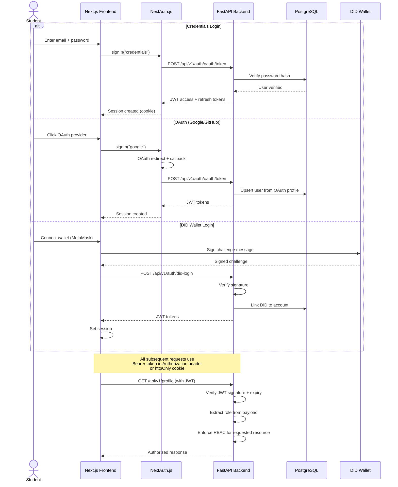
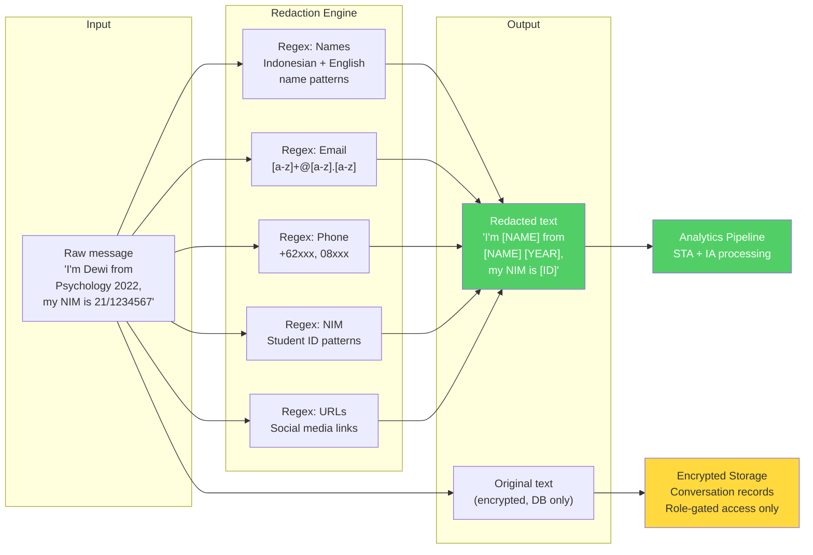
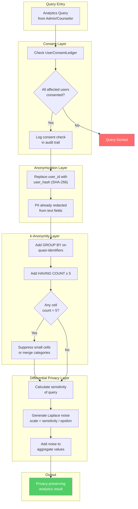
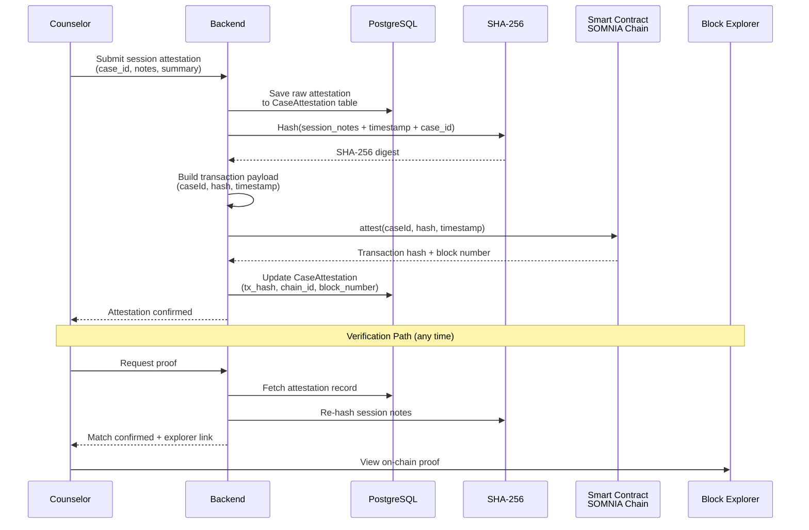
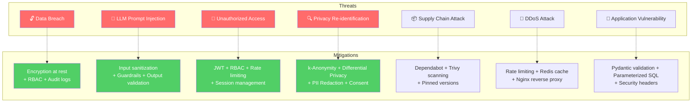

# Security Architecture

UGM-AICare handles sensitive mental health data and must meet high security and privacy standards. This document describes the security controls, authentication flows, and privacy enforcement mechanisms.

---

## Authentication Flow

The system supports multiple authentication methods, unified under a JWT-based session model.

---

## Role-Based Access Control

### RBAC Matrix

```mermaid
graph TB
    subgraph "Roles"
        STU["👤 Student"]
        CNS["👩‍⚕️ Counselor"]
        ADM["🏛️ Admin"]
    end

    subgraph "Student Resources"
        R1["Own profile"]
        R2["Own conversations"]
        R3["Own journal"]
        R4["Own appointments"]
        R5["Own tokens/badges"]
        R6["Public resources"]
    end

    subgraph "Counselor Resources"
        R7["Assigned cases"]
        R8["Assigned patient data"]
        R9["Risk assessments<br/>(assigned patients)"]
        R10["Own schedule"]
        R11["Attestation submission"]
    end

    subgraph "Admin Resources"
        R12["All users (CRUD)"]
        R13["All conversations (read)"]
        R14["System configuration"]
        R15["Analytics & insights"]
        R16["Autopilot management"]
        R17["Audit logs"]
        R18["Blockchain admin"]
        R19["Campaign management"]
    end

    STU --> R1 & R2 & R3 & R4 & R5 & R6
    CNS --> R1 & R7 & R8 & R9 & R10 & R11 & R6
    ADM --> R1 & R12 & R13 & R14 & R15 & R16 & R17 & R18 & R19 & R6
```

### Agent Tool Access by Role

| Tool | Student | Counselor | Admin |
|------|---------|-----------|-------|
| `get_user_profile` | Own only | Assigned patients | All |
| `get_journal_entries` | Own only | Assigned patients | All |
| `get_activity_streak` | Own only | Assigned patients | All |
| `create_intervention_plan` | Yes | Yes | Yes |
| `get_available_counselors` | Yes | No | No |
| `suggest_appointment_times` | Yes | No | No |
| `book_appointment` | Own | No | No |
| `cancel_appointment` | Own | Own sessions | All |
| `get_crisis_resources` | Yes | Yes | Yes |
| `get_case_details` | No | Assigned cases | All |
| `get_conversation_summary` | No | Assigned | All |
| `get_risk_assessment_history` | No | Assigned patients | All |
| `trigger_conversation_analysis` | No | Yes | Yes |
| `get_active_safety_cases` | No | Own cases | All |
| `get_escalation_protocol` | No | Yes | Yes |
| `get_conversation_stats` | No | No | Yes |
| `search_conversations` | No | No | Yes |

---

## PII Redaction Pipeline

### Redaction Rules

| Pattern | Regex Example | Replacement | Applied By |
|---------|--------------|-------------|------------|
| Names | Capitalized word sequences | `[NAME]` | STA `redact_pii_regex` |
| Email | `[\w.]+@[\w.]+` | `[EMAIL]` | STA `redact_pii_regex` |
| Phone | `(\+62|08)\d{8,13}` | `[PHONE]` | STA `redact_pii_regex` |
| NIM/Student ID | `\d{2}/\d{7}` | `[ID]` | STA `redact_pii_regex` |
| URLs | `https?://\S+` | `[URL]` | STA `redact_pii_regex` |

---

## Privacy Enforcement Architecture

---

## Blockchain Attestation Security

### Attestation Properties

| Property | Implementation |
|----------|---------------|
| **Immutability** | On-chain hash cannot be altered after submission |
| **Verifiability** | Any party can re-hash the notes and compare with on-chain hash |
| **Privacy** | Only the hash is stored on-chain; clinical notes remain in encrypted PostgreSQL |
| **Non-repudiation** | Transaction includes counselor's wallet signature |
| **Auditability** | `CaseAttestation` table links case → attestation → tx_hash → chain |

---

## API Security Controls

| Control | Implementation | Scope |
|---------|---------------|-------|
| **Authentication** | JWT Bearer tokens + httpOnly cookies | All endpoints except `/health` |
| **Rate Limiting** | Redis-based per-IP and per-user limits | Chat: 20/min, Auth: 5/min, Admin: 60/min |
| **Input Validation** | Pydantic request models with strict types | All POST/PUT endpoints |
| **CORS** | Whitelisted origins only | All endpoints |
| **SQL Injection** | SQLAlchemy parameterized queries | All database operations |
| **XSS Prevention** | Input sanitization + CSP headers | All endpoints |
| **CSRF Protection** | SameSite cookies + token validation | State-changing endpoints |
| **Secrets Management** | Environment variables, never committed | All configuration |
| **Dependency Scanning** | Trivy + GitHub Dependabot | CI/CD pipeline |
| **TLS** | HTTPS enforced in production | All traffic |

---

## Threat Model

### Risk Assessment

| Threat | Likelihood | Impact | Risk Level | Primary Mitigation |
|--------|-----------|--------|------------|-------------------|
| Data breach (student conversations) | Low | Critical | High | Encryption + RBAC + Audit logs |
| LLM prompt injection | Medium | High | High | Input sanitization + Guardrails |
| Unauthorized access to admin panel | Low | High | Medium | JWT + RBAC + Rate limiting |
| Re-identification via analytics | Low | High | Medium | k-Anonymity + Differential Privacy |
| Supply chain vulnerability | Medium | Medium | Medium | Dependabot + Trivy |
| DDoS during peak usage | Medium | Medium | Medium | Rate limiting + Redis + Nginx |
| SQL injection via API | Low | Critical | Low | SQLAlchemy parameterized queries |
