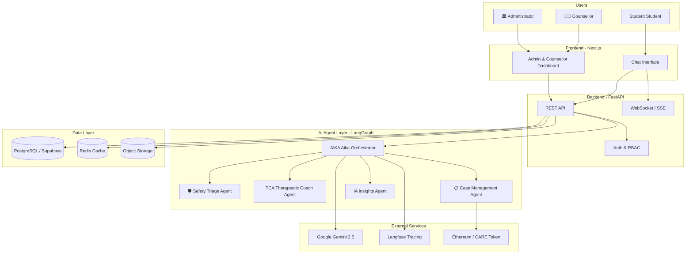
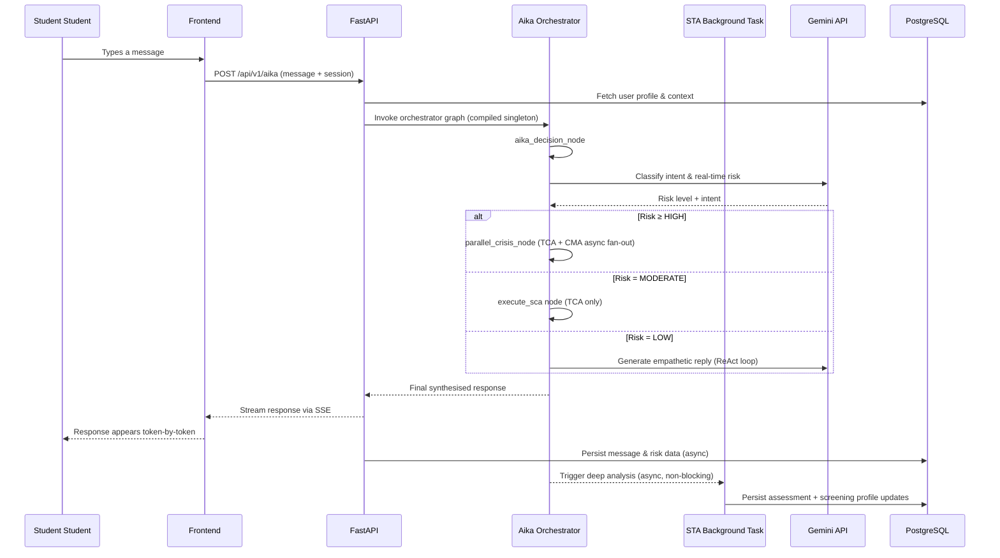

# System Architecture Overview

## The Big Picture

UGM-AICare is structured as a multi-layer system where each component has a distinct responsibility. This architecture includes a user-facing frontend, a coordinating backend API, specialized AI agents, and a secure data layer. Responsibility is distributed across these layers to ensure system integrity and performance.

---

## The Three Core Layers

### 1. Frontend (What Users See)

The frontend is a **Next.js** application deployed at `aicare.sumbu.xyz`. It has two main surfaces:

- **Chat interface** - the conversational window where students talk to Aika. Responses stream in real-time via Server-Sent Events (SSE).
- **Dashboard** - a separate view for counsellors and administrators to see active cases, risk analytics, appointment schedules, and system health.

Authentication uses NextAuth.js with role-based access control (RBAC): students, counsellors, and administrators see different data.

### 2. Backend API (The Coordination Centre)

The backend is a **FastAPI** (Python) application. It handles:

- **REST endpoints** for all reads and writes to the database
- **WebSocket / SSE** for streaming chat responses back to the frontend in real-time
- **Agent invocation** - when a student sends a message, the backend constructs the context payload and invokes the Aika orchestrator graph
- **Scheduled tasks** - background jobs (e.g., post-conversation STA analysis, retention reminders)

The backend is stateless; the conversational state checkpointer lives in **PostgreSQL** via LangGraph's `AsyncPostgresSaver`, and high-speed runtime caching / rate limiting lives in **Redis**.

### 3. AI Agent Layer (Where the Intelligence Lives)

UGM-AICare utilizes a LangGraph-based multi-agent architecture rather than a single monolithic model. A master **Aika Orchestrator** graph handles real-time intent routing and crisis evaluation, fanning out to specialist subgraphs (Therapeutic Coach, Case Management, Insights) when needed. Deep clinical evaluation is handled by the Safety Triage Agent asynchronously as a background task to maintain sub-second response times. This is detailed on the [Agentic Framework](./agentic-framework) page.

---

## Data Flow: A Message from Send to Response

Here is what happens in the time between a student pressing "send" and seeing Aika's reply:

The entire path from message receipt to first token of response typically completes in **300–600 ms** for low-risk conversations.

---

## Security and Privacy Design

Privacy is not an afterthought in this system. Several mechanisms work in concert:

| Mechanism | Where Applied | What It Protects |
|---|---|---|
| **PII Redaction** | STA, before analytics | Personal names, IDs, phone numbers stripped from conversation records used for analysis |
| **k-Anonymity** | IA analytics queries | No query result reveals fewer than *k* individuals (default k=5) |
| **Differential Privacy** | IA aggregate stats | Statistical noise added to aggregates to prevent re-identification |
| **Role-Based Access Control** | API auth layer | Students cannot see other students' data; counsellors see only assigned cases |
| **On-chain Attestation** | CMA / Blockchain | Counsellor session notes anchored to Ethereum; tamper-evident audit trail |

---

## Next Steps

- Understand [how the agents are orchestrated →](./agentic-framework)
- See the [full technology stack](../engineering/tech-stack)
- Meet [Aika, the orchestrator](./meta-agent-aika)
