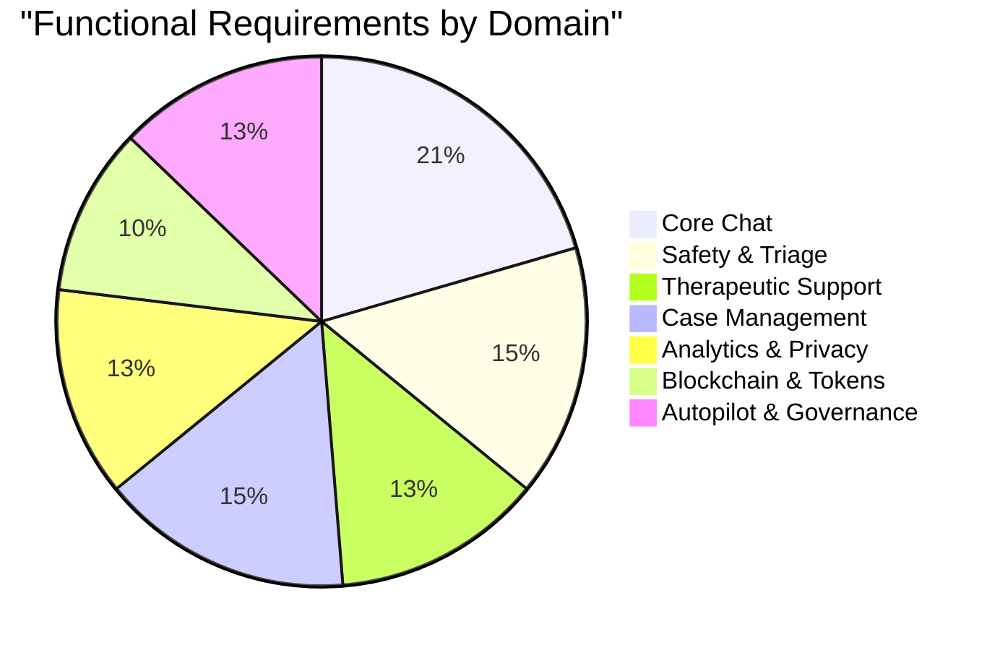
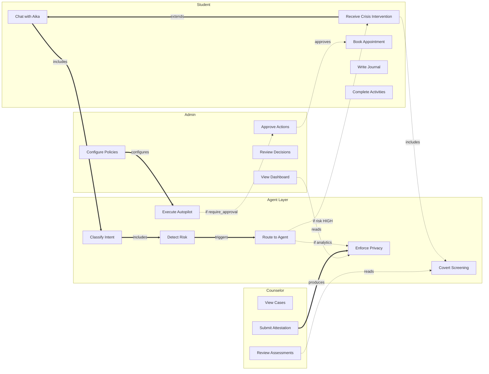

# Use Cases & Functional Requirements

## System Actors

UGM-AICare defines four primary actors, each interacting with the system through distinct surfaces and privilege levels.

```mermaid
graph TB
    subgraph Actors
        STU["👤 Student"]
        CNS["👩‍⚕️ Counselor"]
        ADM["🏛️ Administrator"]
        SYS["🤖 System — Aika"]
    end

    subgraph "UGM-AICare System Boundary"
        UC1["Chat with Aika"]
        UC2["Receive Crisis Intervention"]
        UC3["Book Counseling Appointment"]
        UC4["Write Journal Entries"]
        UC5["Complete Wellness Activities"]
        UC6["Take Mental Health Surveys"]
        UC7["View Assigned Cases"]
        UC8["Review Risk Assessments"]
        UC9["Manage Appointments"]
        UC10["Submit Blockchain Attestation"]
        UC11["View System Dashboard"]
        UC12["Manage Users"]
        UC13["Review Agent Decisions"]
        UC14["Configure Autopilot Policies"]
        UC15["View Population Insights"]
        UC16["Classify Message Intent"]
        UC17["Detect Crisis Risk"]
        UC18["Perform Covert Screening"]
        UC19["Execute Autopilot Actions"]
        UC20["Enforce Privacy Controls"]
    end

    STU --> UC1
    STU --> UC2
    STU --> UC3
    STU --> UC4
    STU --> UC5
    STU --> UC6

    CNS --> UC7
    CNS --> UC8
    CNS --> UC9
    CNS --> UC10

    ADM --> UC11
    ADM --> UC12
    ADM --> UC13
    ADM --> UC14
    ADM --> UC15

    SYS --> UC16
    SYS --> UC17
    SYS --> UC18
    SYS --> UC19
    SYS --> UC20

    UC1 -.->|includes| UC16
    UC1 -.->|includes| UC17
    UC2 -.->|includes| UC18
    UC13 -.->|triggers| UC19
    UC15 -.->|requires| UC20
```

---

## Actor Definitions

### Student

The primary end-user. Students interact with Aika through a chat interface, maintain journals, complete quests and surveys, book counseling appointments, and earn Care Tokens through engagement.

| ID | Use Case | Description |
|----|----------|-------------|
| UC-S01 | Chat with Aika | Engage in natural-language mental health support conversations via the chat interface with real-time SSE streaming |
| UC-S02 | Receive Crisis Intervention | When the system detects high/critical risk, automatically receive an immediate coping plan (TCA) and case creation (CMA) in parallel |
| UC-S03 | Book Counseling Appointment | Conversationally schedule sessions with available counselors through Aika's tool-calling interface |
| UC-S04 | Write Journal Entries | Create timestamped journal entries with mood scoring and optional tagging for longitudinal self-reflection |
| UC-S05 | Complete Wellness Activities | Engage in structured wellness activities (breathing exercises, grounding techniques, behavioral activation tasks) curated by the TCA catalog |
| UC-S06 | Take Mental Health Surveys | Complete standardized instruments (PHQ-9, GAD-7, DASS-21) for explicit self-assessment alongside passive screening |
| UC-S07 | View Personal Resources | Access curated mental health resources filtered by language, category, and relevance |
| UC-S08 | Earn Care Tokens & Badges | Receive on-chain Care Tokens and NFT achievement badges for engagement milestones |
| UC-S09 | View Proof & Attestations | View the proof timeline of autopilot actions and counselor session attestations |
| UC-S10 | Manage Profile & Preferences | Update personal information, language preferences, notification settings, and consent records |
| UC-S11 | Provide Feedback | Rate intervention quality and provide qualitative feedback on agent interactions |

### Counselor

Licensed professionals who review risk assessments, conduct sessions, and submit on-chain attestations.

| ID | Use Case | Description |
|----|----------|-------------|
| UC-C01 | View Assigned Cases | Access the case queue with risk levels, student context, and SLA deadlines |
| UC-C02 | Review Risk Assessments | Read detailed risk assessment reports generated by STA, including instrument scores and conversation summaries |
| UC-C03 | Manage Appointments | View, confirm, reschedule, or cancel upcoming sessions within their schedule |
| UC-C04 | Write Session Notes | Record clinical observations and intervention summaries for assigned cases |
| UC-C05 | Submit Blockchain Attestation | Hash session notes and submit on-chain proof of session delivery for immutable audit trail |
| UC-C06 | View Conversation Summaries | Read AI-generated conversation summaries for assigned students |
| UC-C07 | Review Treatment Plans | View and update intervention plans generated by TCA |
| UC-C08 | Manage Availability Schedule | Configure weekly available time slots for appointment booking |
| UC-C09 | Track Patient Progress | Monitor longitudinal screening profiles and risk trends for assigned students |

### Administrator

System operators responsible for oversight, configuration, and population-level analytics.

| ID | Use Case | Description |
|----|----------|-------------|
| UC-A01 | View System Dashboard | Access real-time metrics: active users, agent health, case volumes, risk distribution |
| UC-A02 | Manage Users | Create, modify, deactivate student and counselor accounts |
| UC-A03 | Review Agent Decisions | Audit Aika routing decisions, STA risk classifications, and autopilot action history |
| UC-A04 | Configure Autopilot Policies | Set allow/require-approval/deny rules per risk level and action type |
| UC-A05 | Approve/Reject Autopilot Actions | Review queued high-risk autopilot actions and approve or deny execution |
| UC-A06 | View Population-Level Insights | Run k-anonymous analytics queries through the IA for institutional reporting |
| UC-A07 | Manage Blockchain Contracts | Configure smart contract addresses, supported chains, and attestation settings |
| UC-A08 | Configure System Settings | Manage feature flags, scheduling parameters, and global system configuration |
| UC-A09 | View Audit Logs | Access immutable audit trail of all system actions and data access events |
| UC-A10 | Manage Campaigns & Outreach | Create and schedule targeted mental health campaigns and check-in reminders |
| UC-A11 | Manage Screening Settings | Configure screening thresholds, instrument weights, and decay parameters |

### System (Aika)

The autonomous agent layer that operates continuously without direct human initiation.

| ID | Use Case | Description |
|----|----------|-------------|
| UC-SY01 | Classify Message Intent | Parse incoming messages into intent categories using Gemini LLM with structured JSON output |
| UC-SY02 | Detect Crisis Risk Level | Perform two-tier risk assessment: instant keyword scan (Tier 1) and semantic LLM analysis (Tier 2) |
| UC-SY03 | Route to Specialist Agent | Dispatch messages to TCA, CMA, IA, or direct response path based on intent and risk |
| UC-SY04 | Generate Empathetic Responses | Produce contextually appropriate replies using ReAct-style tool calling with Gemini |
| UC-SY05 | Perform Covert Screening | Extract psychological indicators from natural conversation and map to validated instruments |
| UC-SY06 | Manage Conversation State | Persist and restore conversational context through LangGraph's AsyncPostgresSaver |
| UC-SY07 | Trigger Background STA Analysis | Launch non-blocking post-conversation deep clinical analysis |
| UC-SY08 | Execute Autopilot Actions | Perform policy-governed autonomous actions (appointment booking, follow-up scheduling, check-in triggers) |
| UC-SY09 | Enforce Privacy Controls | Apply PII redaction, k-anonymity, and consent checks before any analytics or storage |
| UC-SY10 | Track Execution Telemetry | Record node-level performance metrics, error rates, and token usage via LangGraphExecution tracking |

---

## Functional Requirements

### Core Chat

| ID | Requirement | Priority | Related Use Cases |
|----|-------------|----------|-------------------|
| FR-CC01 | The system shall accept natural-language messages via REST API and stream responses via SSE | Must | UC-S01 |
| FR-CC02 | The system shall maintain conversational context across sessions using persistent checkpointing | Must | UC-S01, UC-SY06 |
| FR-CC03 | The system shall classify message intent into at least 6 categories within 500ms | Must | UC-SY01 |
| FR-CC04 | The system shall cap conversation history at 10 turns (20 messages) for LLM input to control token costs | Should | UC-SY06 |
| FR-CC05 | The system shall detect small-talk patterns and bypass sub-agent invocation for efficiency | Should | UC-SY01 |
| FR-CC06 | The system shall support role-adaptive responses (student, counselor, admin personas) | Must | UC-S01 |
| FR-CC07 | The system shall provide multilingual support (Bahasa Indonesia and English) | Should | UC-S01 |
| FR-CC08 | The system shall broadcast real-time activity events to connected frontend clients via SSE | Should | UC-S01 |

### Safety & Triage

| ID | Requirement | Priority | Related Use Cases |
|----|-------------|----------|-------------------|
| FR-ST01 | The system shall perform instant (<5ms) keyword-based crisis detection on every incoming message | Must | UC-SY02 |
| FR-ST02 | The system shall perform semantic LLM-based risk classification with 4 severity bands (none/low/moderate/high/critical) | Must | UC-SY02 |
| FR-ST03 | The system shall trigger background deep analysis after every conversation for longitudinal tracking | Must | UC-SY07 |
| FR-ST04 | The system shall extract covert screening indicators mapped to PHQ-9, GAD-7, DASS-21, PSQI, UCLA, RSES, C-SSRS, AUDIT, SSI | Must | UC-SY05 |
| FR-ST05 | The system shall maintain a decaying screening profile with configurable decay factor (default 0.95) | Must | UC-SY05 |
| FR-ST06 | The system shall generate psychologist-ready assessment reports for counselor review | Should | UC-C02 |

### Therapeutic Support

| ID | Requirement | Priority | Related Use Cases |
|----|-------------|----------|-------------------|
| FR-TS01 | The system shall generate CBT-based intervention plans with structured steps | Must | UC-S02 |
| FR-TS02 | The system shall maintain a curated wellness activity catalog with category-based filtering | Must | UC-S05 |
| FR-TS03 | The system shall integrate journaling prompts with mood scoring | Should | UC-S04 |
| FR-TS04 | The system shall apply a safety review gate before delivering any intervention plan | Must | UC-S02 |
| FR-TS05 | The system shall provide fallback default plans when LLM generation fails | Must | UC-S02 |

### Case Management

| ID | Requirement | Priority | Related Use Cases |
|----|-------------|----------|-------------------|
| FR-CM01 | The system shall automatically create cases when risk reaches HIGH/CRITICAL level | Must | UC-S02 |
| FR-CM02 | The system shall rank counselors by specialty match, caseload, availability, and language | Must | UC-S03 |
| FR-CM03 | The system shall enforce SLA deadlines per risk level (4h critical, 24h high, 72h moderate) | Must | UC-C03 |
| FR-CM04 | The system shall support conversational appointment booking through tool calling | Must | UC-S03 |
| FR-CM05 | The system shall track full case lifecycle from open to closed with state transitions | Must | UC-C01 |
| FR-CM06 | The system shall generate alerts for SLA breaches visible on admin dashboard | Should | UC-A01 |

### Analytics & Privacy

| ID | Requirement | Priority | Related Use Cases |
|----|-------------|----------|-------------------|
| FR-AP01 | The system shall enforce k-anonymity (k≥5) on all analytics queries | Must | UC-SY09 |
| FR-AP02 | The system shall apply differential privacy noise injection on aggregate statistics | Should | UC-SY09 |
| FR-AP03 | The system shall redact PII from all text before analytics processing | Must | UC-SY09 |
| FR-AP04 | The system shall check user consent before including data in any analytics query | Must | UC-SY09 |
| FR-AP05 | The system shall generate PDF reports for institutional stakeholders | Should | UC-A06 |

### Blockchain & Tokens

| ID | Requirement | Priority | Related Use Cases |
|----|-------------|----------|-------------------|
| FR-BT01 | The system shall hash counselor attestations (SHA-256) and submit on-chain | Must | UC-C05 |
| FR-BT02 | The system shall support multi-chain NFT badges (EDU Chain, BNB Smart Chain) | Should | UC-S08 |
| FR-BT03 | The system shall maintain a Care Token economy on SOMNIA chain | Should | UC-S08 |
| FR-BT04 | The system shall degrade gracefully when blockchain services are unavailable | Must | UC-C05 |

### Autopilot & Governance

| ID | Requirement | Priority | Related Use Cases |
|----|-------------|----------|-------------------|
| FR-AG01 | The system shall evaluate all autopilot actions against a configurable policy matrix | Must | UC-SY08 |
| FR-AG02 | The system shall require explicit admin approval for high-risk autonomous actions | Must | UC-A05 |
| FR-AG03 | The system shall maintain an immutable audit trail of all autopilot decisions | Must | UC-A03 |
| FR-AG04 | The system shall execute approved actions with retry scheduling and dead-letter handling | Must | UC-SY08 |
| FR-AG05 | The system shall support idempotent action execution to prevent duplicate side effects | Must | UC-SY08 |

---

## Requirements Distribution

---

## Use Case Relationships

The following diagram shows how use cases relate to each other through `«include»` and `«extend»` dependencies.

---

## Non-Functional Requirements

| Category | Requirement | Target |
|----------|-------------|--------|
| **Performance** | First token response time | < 600ms for low-risk conversations |
| **Performance** | STA keyword scan latency | < 5ms per message |
| **Availability** | System uptime | ≥ 99.5% (excluding maintenance) |
| **Security** | All API endpoints authenticated | 100% |
| **Privacy** | k-anonymity enforced on analytics | k ≥ 5 |
| **Scalability** | Concurrent chat sessions | ≥ 100 simultaneous |
| **Observability** | Langfuse trace coverage | All agent invocations |
| **Compliance** | Consent ledger coverage | All data access events |
