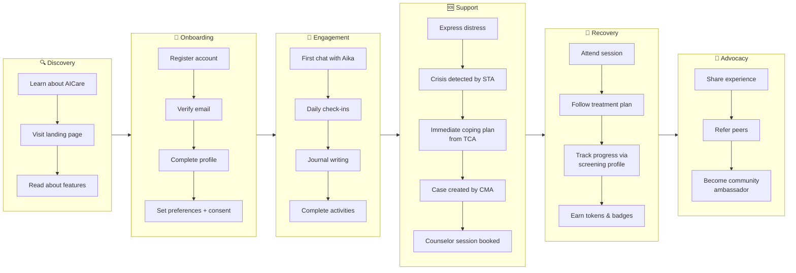
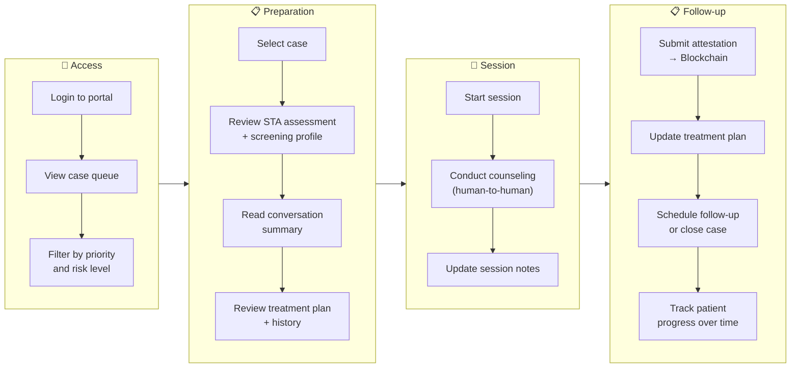
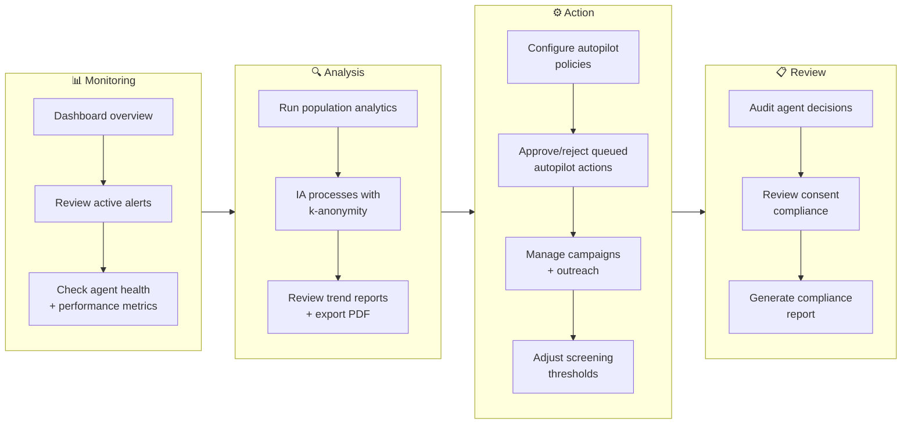
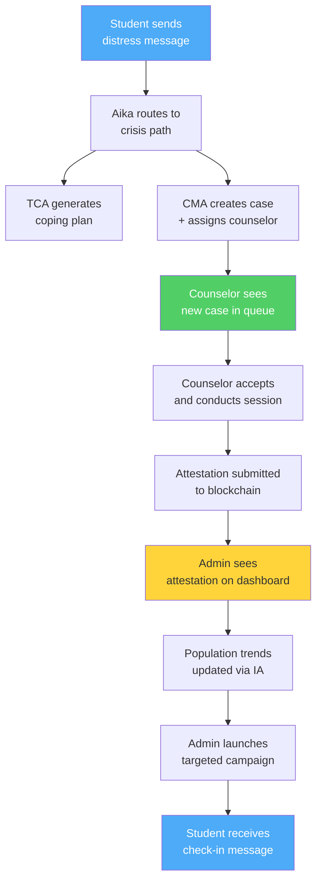

# User Journey Maps

This document maps the end-to-end experience of each primary user role through the UGM-AICare system, showing touchpoints with agents, emotional states, and key metrics at each phase.

---

## 1. Student Journey

The student journey spans six phases from initial discovery through long-term engagement.

### Emotional States & System Touchpoints

| Phase | Emotional State | System Touchpoint | Agent Involved |
|-------|----------------|-------------------|----------------|
| Discovery | Curious, cautious | Landing page, features page | None |
| Onboarding | Hopeful, uncertain | Registration form, consent UI | None |
| Engagement — first chat | Vulnerable, testing | Chat interface, SSE streaming | Aika (direct response) |
| Engagement — daily | Comfortable, trusting | Check-in notifications, journal | Aika + STA (background) |
| Support — distress | Anxious, fearful | Crisis keyword triggers immediate response | STA (Tier 1) + Aika (routing) |
| Support — intervention | Relieved, supported | Coping plan delivery, appointment booking | TCA + CMA (parallel) |
| Recovery — session | Open, engaged | Counselor session (human) | CMA (scheduling) |
| Recovery — follow-up | Improving, motivated | Treatment plan, wellness activities | TCA (activities) |
| Advocacy | Empowered, grateful | Care tokens, badges, sharing | Blockchain (attestations) |

### Student Success Metrics

| Metric | Target | Measurement |
|--------|--------|-------------|
| Registration completion rate | ≥ 70% | Profiles created / registrations started |
| First chat within 24h of signup | ≥ 50% | First message timestamp - account creation |
| Weekly active engagement | ≥ 3 sessions/week | Sessions per active student per week |
| Journal entry frequency | ≥ 1 per week | Journal entries / active students |
| Crisis response satisfaction | ≥ 4.0/5.0 | Post-crisis feedback rating |

---

## 2. Counselor Journey

### Counselor System Touchpoints

| Phase | Primary Interface | Data Sources | Agent Interaction |
|-------|------------------|--------------|-------------------|
| Access | Counselor portal login | User session, role verification | None (auth layer) |
| Preparation | Case detail view | ConversationRiskAssessment, ScreeningProfile, Conversation summary | STA reports (read) |
| Session | External (video/phone) | Session notes editor | CMA (case status updates) |
| Follow-up | Attestation form + calendar | CaseAttestation, Appointment | CMA + Blockchain |

### Counselor Success Metrics

| Metric | Target | Measurement |
|--------|--------|-------------|
| Case pickup within SLA | ≥ 90% | Time from assignment to first action |
| Attestation submission rate | 100% | Sessions with on-chain attestation |
| Case resolution rate | ≥ 75% | Cases closed / cases opened |
| Patient risk improvement | Measured per case | Pre/post screening profile delta |

### Counselor Pain Points & Mitigations

| Pain Point | Mitigation |
|------------|------------|
| High caseload during peak periods | Load-balanced assignment algorithm; admin escalation alerts |
| Incomplete patient history | STA auto-generates conversation summaries and risk reports |
| Scheduling conflicts | TherapistSchedule integration; conflict detection before booking |
| Manual attestation overhead | One-click attestation with automatic hash + on-chain submission |

---

## 3. Administrator Journey

### Administrator System Touchpoints

| Phase | Primary Interface | Data Sources | Agent Interaction |
|-------|------------------|--------------|-------------------|
| Monitoring | Admin dashboard | LangGraphExecution, Alert, AgentHealthLog | All agents (read metrics) |
| Analysis | Insights + Analytics views | InsightsReport, analytics queries | IA (query execution) |
| Action | Autopilot + Campaign management | AutopilotAction, Campaign | Aika (policy evaluation) |
| Review | Agent Decisions + Audit Logs | LangGraphNodeExecution, UserAuditLog | All agents (audit trail) |

### Administrator Success Metrics

| Metric | Target | Measurement |
|--------|--------|-------------|
| Alert response time | < 4 hours | Time from alert creation to admin action |
| Autopilot approval latency | < 24 hours | Time from action queued to approved/rejected |
| Analytics query success rate | ≥ 95% | Successful queries / total queries |
| System uptime | ≥ 99.5% | Uptime percentage per month |

---

## Cross-Journey Interactions

The three user journeys are not independent. The following diagram shows how actions by one role trigger responses visible to others.

