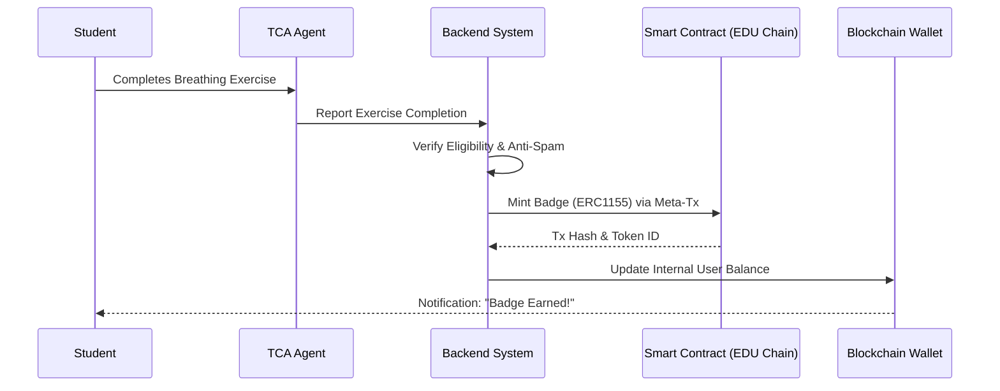

# $CARE Token Implementation Summary

## [Done] What Was Created

### 1. Smart Contract (`blockchain/contracts/CareToken.sol`)

**ERC-20 Utility Token with Advanced Features:**
- [Done] Standard ERC-20 functionality (transfer, approve, transferFrom)
- [Done] Burnable tokens (users can burn to reduce supply)
- [Done] Pausable transfers (emergency stop mechanism)
- [Done] Role-based access control (ADMIN, MINTER, PAUSER)
- [Done] EIP-2612 Permit (gasless approvals)
- [Done] Capped supply at 1 billion CARE tokens
- [Done] Transparent minting with on-chain reasons
- [Done] Query functions (maxSupply, totalMinted, remainingMintable)

**Security Features:**
- OpenZeppelin battle-tested contracts
- No reentrancy vulnerabilities
- Role-based permissions
- Emergency pause capability
- Supply cap enforcement

### 2. Hardhat Configuration (`blockchain/hardhat.config.ts`)

**Added SOMNIA Network Support:**
- [Done] SOMNIA Mainnet configuration (Chain ID: 5031)
- [Done] SOMNIA Testnet configuration (Chain ID: 50312)
- [Done] Existing EDUChain Testnet preserved
- [Done] Separate private keys for testnet/mainnet
- [Done] Gas optimization settings
- [Done] Explorer verification setup (commented for future)

### 3. Deployment Script (`blockchain/scripts/deployCareToken.ts`)

**Professional Deployment Tool:**
- [Done] Network detection (mainnet/testnet)
- [Done] Balance checking before deployment
- [Done] Comprehensive deployment logging
- [Done] Automatic token info retrieval
- [Done] Role verification
- [Done] Explorer link generation
- [Done] Deployment summary with JSON output
- [Done] Next steps guidance

### 4. Environment Configuration (`blockchain/.env.example`)

**Complete Environment Template:**
- [Done] SOMNIA Mainnet RPC URLs
- [Done] SOMNIA Testnet RPC URLs
- [Done] Private key management (testnet/mainnet)
- [Done] Contract address tracking
- [Done] Network selection variables
- [Done] Security notes and best practices

### 5. Backend Integration (`backend/app/services/care_token_service.py`)

**Python Service for Blockchain Interaction:**
- [Done] Web3.py integration with SOMNIA
- [Done] Automatic ABI loading from Hardhat artifacts
- [Done] Balance checking functionality
- [Done] Token minting with transaction confirmation
- [Done] Token info queries
- [Done] Singleton pattern for efficiency
- [Done] Comprehensive error handling
- [Done] Logging for debugging
- [Done] Fallback minimal ABI

### 6. API Endpoints (`backend/app/routes/care_token.py`)

**RESTful API for Token Operations:**
- [Done] `GET /api/v1/care-token/balance/{wallet}` - Check any wallet balance
- [Done] `GET /api/v1/care-token/my-balance` - Get authenticated user balance
- [Done] `GET /api/v1/care-token/info` - Get token contract information
- [Done] `POST /api/v1/care-token/mint` - Mint tokens (admin only)
- [Done] Pydantic models for validation
- [Done] Dependency injection pattern
- [Done] Explorer URL generation
- [Done] Error handling

### 7. Documentation (`blockchain/CARE_TOKEN_README.md`)

**Comprehensive Guide Including:**
- [Done] Token overview and specifications
- [Done] Use cases (vouchers, events, rewards)
- [Done] SOMNIA blockchain details
- [Done] Deployment instructions
- [Done] Backend integration guide (Python)
- [Done] Frontend integration guide (Next.js)
- [Done] Token economics and distribution plan
- [Done] Reward schedule examples
- [Done] Merchant voucher pricing
- [Done] Security best practices
- [Done] Useful commands
- [Done] Resources and links

### 8. Dependencies Updated (`backend/requirements.txt`)

**Added Blockchain Libraries:**
- [Done] `web3>=6.0.0` - Ethereum/SOMNIA interaction

---

## Next Steps to Deploy

### Step 1: Install Dependencies

**Blockchain (Hardhat):**
```bash
cd blockchain
npm install
```

**Backend (Python):**
```bash
cd backend
pip install -r requirements.txt
```

### Step 2: Configure Environment

1. **Copy environment template:**
```bash
cd blockchain
cp.env.example.env
```

2. **Set required variables in `.env`:**
```env
# For testnet deployment
SOMNIA_TESTNET_RPC_URL=https://dream-rpc.somnia.network/
TESTNET_PRIVATE_KEY=your_testnet_private_key_without_0x

# For mainnet deployment (later)
SOMNIA_MAINNET_RPC_URL=https://api.infra.mainnet.somnia.network/
MAINNET_PRIVATE_KEY=your_mainnet_private_key_without_0x
```

### Step 3: Get Testnet Tokens

1. **Add SOMNIA Testnet to MetaMask:**
 - Network Name: SOMNIA Testnet
 - RPC URL: https://dream-rpc.somnia.network/
 - Chain ID: 50312
 - Currency Symbol: STT

2. **Get test tokens from faucet:**
 - https://stakely.io/faucet/somnia-testnet-stt
 - Or: https://cloud.google.com/application/web3/faucet/somnia/shannon

### Step 4: Deploy to Testnet

```bash
cd blockchain
npx hardhat compile
npx hardhat run scripts/deployCareToken.ts --network somniaTestnet
```

**Expected output:**
```
[Start] Starting CareToken deployment on SOMNIA blockchain...
[Address] Deploying from account: 0x...
💰 Account balance: 100.0 STT
🌐 Network: somniaTestnet
🔗 Chain ID: 50312
[Done] Deploying to SOMNIA TESTNET (Shannon)...
[Done] CareToken deployed successfully!
[Address] Contract Address: 0x...
🔍 View on Explorer: https://shannon-explorer.somnia.network/address/0x...
```

### Step 5: Save Contract Address

1. **Copy the deployed contract address**

2. **Update backend `.env`:**
```env
CARE_TOKEN_ADDRESS=0x...deployed_contract_address...
SOMNIA_RPC_URL=https://dream-rpc.somnia.network/
CARE_MINTER_PRIVATE_KEY=your_minter_wallet_private_key
```

3. **Update frontend `.env.local`:**
```env
NEXT_PUBLIC_CARE_TOKEN_ADDRESS=0x...deployed_contract_address...
NEXT_PUBLIC_SOMNIA_CHAIN_ID=50312
```

### Step 6: Grant Minter Role to Backend

The backend needs MINTER_ROLE to reward users. Use Hardhat console:

```bash
npx hardhat console --network somniaTestnet
```

Then:
```javascript
const CareToken = await ethers.getContractFactory("CareToken")
const token = await CareToken.attach("YOUR_CONTRACT_ADDRESS")

// Grant MINTER_ROLE to backend wallet
const MINTER_ROLE = await token.MINTER_ROLE()
await token.grantRole(MINTER_ROLE, "BACKEND_WALLET_ADDRESS")

// Verify
const hasRole = await token.hasRole(MINTER_ROLE, "BACKEND_WALLET_ADDRESS")
console.log("Backend has MINTER_ROLE:", hasRole)
```

### Step 7: Test Token Operations

**Test minting:**
```bash
npx hardhat console --network somniaTestnet
```

```javascript
const token = await ethers.getContractAt("CareToken", "CONTRACT_ADDRESS")

// Mint 100 CARE to a test wallet
await token.mintTokens(
 "0xTestWalletAddress",
 100,
 "Test reward"
)

// Check balance
const balance = await token.balanceOf("0xTestWalletAddress")
console.log(ethers.formatEther(balance), "CARE")
```

### Step 8: Integrate with Backend

1. **Add route to main app:**
```python
# backend/app/main.py
from app.routes import care_token

app.include_router(care_token.router)
```

2. **Test API endpoints:**
```bash
# Get token info
curl http://localhost:8000/api/v1/care-token/info

# Check balance
curl http://localhost:8000/api/v1/care-token/balance/0xWalletAddress
```

### Step 9: Frontend Integration

Create wallet connection and token display components:

1. **Install dependencies:**
```bash
cd frontend
npm install ethers wagmi viem @rainbow-me/rainbowkit
```

2. **Configure SOMNIA in wagmi** (see CARE_TOKEN_README.md)

3. **Create balance component** (see CARE_TOKEN_README.md)

4. **Add to user dashboard**

### Step 10: Deploy to Mainnet (When Ready)

[Warning] **Only after thorough testing!**

1. **Get real SOMI tokens** (SOMNIA's native token)
2. **Use separate mainnet wallet** (preferably hardware wallet)
3. **Update `.env` with mainnet settings**
4. **Deploy:**
```bash
npx hardhat run scripts/deployCareToken.ts --network somniaMainnet
```
5. **Verify on explorer:** https://explorer.somnia.network

---

## Recommended Token Economics

### Initial Distribution (100M CARE)
- **10M CARE** → Platform reserve
- **30M CARE** → Rewards pool (first year)
- **30M CARE** → Merchant partnerships
- **20M CARE** → Team & advisors (vested)
- **10M CARE** → Community treasury

### Minting Schedule
- Mint gradually as needed
- Never exceed 1B total supply
- Track all mints with reasons
- Monthly review of token distribution

### Reward Examples
| Activity | CARE Reward |
|----------|------------|
| Daily check-in | 10 |
| Complete CBT module | 50 |
| 7-day streak | 100 |
| 30-day streak | 500 |
| Refer friend | 200 |
| Share story | 30 |

### Voucher Prices
| Item | CARE Cost |
|------|-----------|
| Gojek/Grab ride (20k IDR) | 100 |
| Food voucher (50k IDR) | 200 |
| Store voucher (100k IDR) | 500 |
| Movie ticket | 800 |
| Book store | 1,000 |

---

## Security Checklist

- [ ] Private keys stored securely (never in git)
- [ ] Separate wallets for admin, minter, pauser
- [ ] Hardware wallet for mainnet admin
- [ ] MINTER_ROLE granted only to trusted backend
- [ ] PAUSER_ROLE ready for emergencies
- [ ] Monitor contract events for suspicious activity
- [ ] Set up alerts for large transfers
- [ ] Regular role audits
- [ ] Backup all wallet keys securely
- [ ] Document all mainnet transactions

---

## Monitoring & Maintenance

### What to Monitor
1. **Token Supply**: Track total minted vs. max supply
2. **Large Transfers**: Alert on transfers > 10,000 CARE
3. **Minting Activity**: Review all mints weekly
4. **Balance Distribution**: Ensure no whale concentration
5. **Contract Pauses**: Investigate any pause events

### Tools to Use
1. **SOMNIA Explorer**: https://explorer.somnia.network
2. **Backend Logs**: Monitor `care_token_service.py` logs
3. **Database**: Track all reward transactions
4. **Web3 Events**: Subscribe to Transfer, TokensMinted events

### Regular Tasks
- **Weekly**: Review minting activity and token distribution
- **Monthly**: Audit role assignments and permissions
- **Quarterly**: Evaluate token economics and adjust rewards
- **Yearly**: Full security audit and contract review

---

## Troubleshooting

### Common Issues

**"Failed to connect to SOMNIA blockchain"**
- Check RPC URL in.env
- Verify internet connection
- Try alternative RPC (stakely.io)

**"TESTNET_PRIVATE_KEY not set"**
- Copy.env.example to.env
- Add your private key (without 0x prefix)

**"Insufficient funds for gas"**
- Get testnet tokens from faucet
- Check balance: `await ethers.provider.getBalance(address)`

**"Minting would exceed max supply"**
- Current supply is near 1B cap
- Check: `await token.remainingMintable()`
- Consider burning unused tokens

**"Not authorized to mint tokens"**
- Grant MINTER_ROLE to backend wallet
- Verify: `await token.hasRole(MINTER_ROLE, address)`

---

## Resources

- **SOMNIA Docs**: https://docs.somnia.network/
- **SOMNIA Discord**: https://discord.gg/Somnia
- **OpenZeppelin Docs**: https://docs.openzeppelin.com/contracts/
- **Hardhat Docs**: https://hardhat.org/docs
- **Web3.py Docs**: https://web3py.readthedocs.io/

---

##  Congratulations!

You've successfully created the $CARE token for UGM-AICare on SOMNIA blockchain! 🎉

The token is now ready to:
- [Done] Reward users for mental health activities
- [Done] Enable real-world purchases (vouchers, tickets)
- [Done] Power the entire UGM-AICare economy
- [Done] Scale to millions of transactions (thanks to SOMNIA's 1M+ TPS)

**Next**: Start testing on SOMNIA Testnet, then integrate with your reward system!

---

*Built with ❤️ for Indonesian university students' mental health*
## Achievement Badge Lifecycle

To incentivize proactive mental health engagement, the system issues on-chain achievement badges (ERC1155 tokens) for positive actions, such as completing therapeutic exercises.


