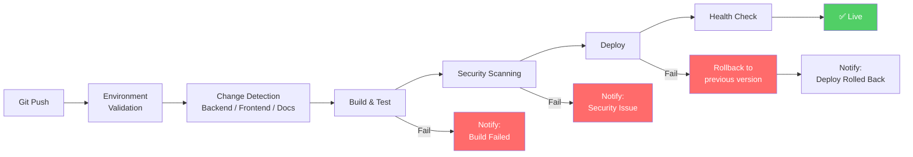
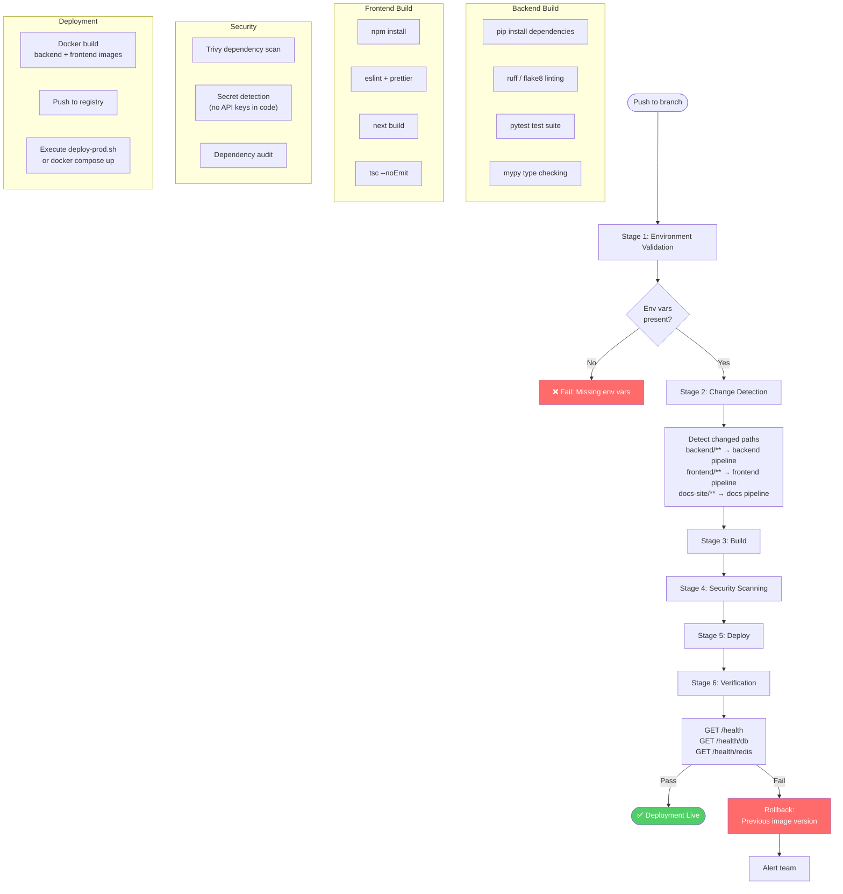
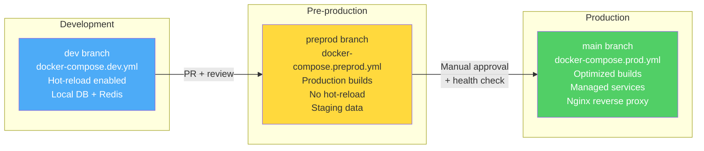

# CI/CD Pipeline

This document describes the continuous integration and deployment pipeline for UGM-AICare.

---

## Pipeline Overview

---

## Detailed Pipeline Stages

---

## Promotion Flow

---

## Deployment Strategy

| Environment | Branch | Command | Database |
|-------------|--------|---------|----------|
| Local Dev | `feature/*` | `docker compose -f docker-compose.base.yml -f docker-compose.dev.yml up` | Local PostgreSQL |
| Pre-production | `preprod` | `docker compose -f docker-compose.base.yml -f docker-compose.preprod.yml up` | Staging DB |
| Production | `main` | `./deploy-prod.sh` or `docker compose -f docker-compose.base.yml -f docker-compose.prod.yml up -d` | Managed PostgreSQL |

### Rollback Procedure

1. Identify the failing deployment from health checks
2. Pull the previous known-good image version
3. Redeploy with `docker compose up -d` using previous image tag
4. Verify health checks pass
5. Investigate the failed deployment in logs

---

## Failure Scenarios

| Scenario | Detection | Response |
|----------|-----------|----------|
| Build fails | Non-zero exit from build step | Block deployment, notify via GitHub |
| Test failure | pytest / jest non-zero exit | Block deployment, report failures |
| Security vulnerability | Trivy CRITICAL finding | Block deployment, create issue |
| Health check failure | `/health` returns non-200 | Auto-rollback to previous image |
| Database migration fails | Alembic exit code | Block deployment, manual intervention |
| Docker build fails | Build step non-zero exit | Block deployment, notify |
