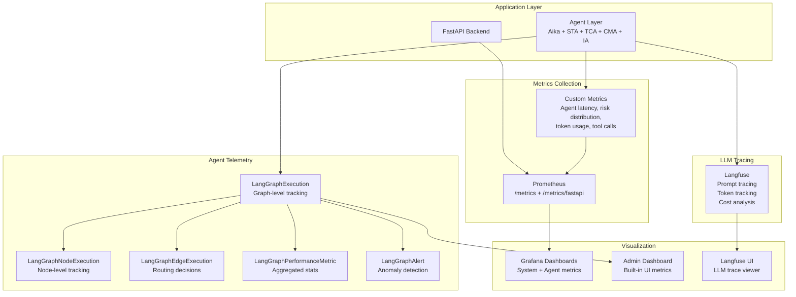
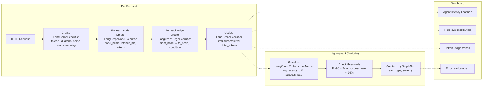
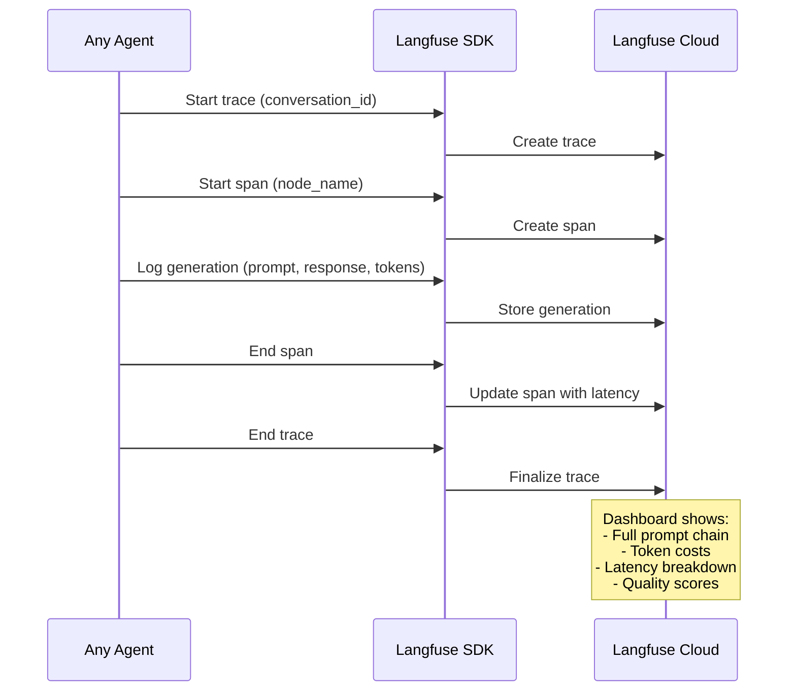

# Monitoring & Observability

UGM-AICare implements multi-layer observability through structured logging, Prometheus metrics, Langfuse LLM tracing, and agent execution tracking.

---

## Observability Architecture



---

## Prometheus Metrics

### FastAPI Auto-instrumented Metrics

| Metric | Type | Description |
|--------|------|-------------|
| `http_requests_total` | Counter | Total HTTP requests by method, status, endpoint |
| `http_request_duration_seconds` | Histogram | Request latency distribution |
| `http_requests_in_progress` | Gauge | Currently processing requests |

### Custom Agent Metrics

| Metric | Type | Description |
|--------|------|-------------|
| `agent_invocation_total` | Counter | Agent invocations by agent_role, intent, routing_decision |
| `agent_latency_ms` | Histogram | Execution time per agent node |
| `agent_tokens_used` | Counter | LLM token consumption by model, agent |
| `agent_errors_total` | Counter | Errors by agent_role, error_type |
| `risk_level_distribution` | Counter | Risk level assignments (0-3) |
| `tool_call_total` | Counter | Tool invocations by tool_name, success/failure |
| `autopilot_actions_total` | Counter | Autopilot decisions by policy_result |

---

## Agent Execution Tracking



---

## Structured Logging

All application logs use structured JSON format:

```json
{
  "timestamp": "2026-04-23T14:23:11.456Z",
  "level": "INFO",
  "module": "aika.decision_node",
  "function": "aika_decision_node",
  "message": "Routing decision completed",
  "user_id": 1203,
  "conversation_id": 4812,
  "intent": "academic_stress",
  "risk_level": 1,
  "routing": "execute_sca",
  "latency_ms": 342,
  "tokens_used": 847,
  "request_id": "req_abc123"
}
```

### Log Levels

| Level | Usage |
|-------|-------|
| `DEBUG` | Detailed agent state, tool call inputs/outputs |
| `INFO` | Request processing, routing decisions, agent invocations |
| `WARNING` | Fallback activations, rate limit approaches, retry attempts |
| `ERROR` | Agent failures, LLM errors, database connection issues |
| `CRITICAL` | System startup failures, security events |

---

## Langfuse Integration



### What Langfuse Tracks

| Entity | Fields Tracked |
|--------|---------------|
| **Trace** | conversation_id, user_id, agent_version, total_tokens, total_cost |
| **Span** | node_name, agent_role, input/output tokens, latency_ms |
| **Generation** | model, prompt_template, completion, temperature, token counts |
| **Event** | tool_name, tool_args, tool_result, success/failure |
