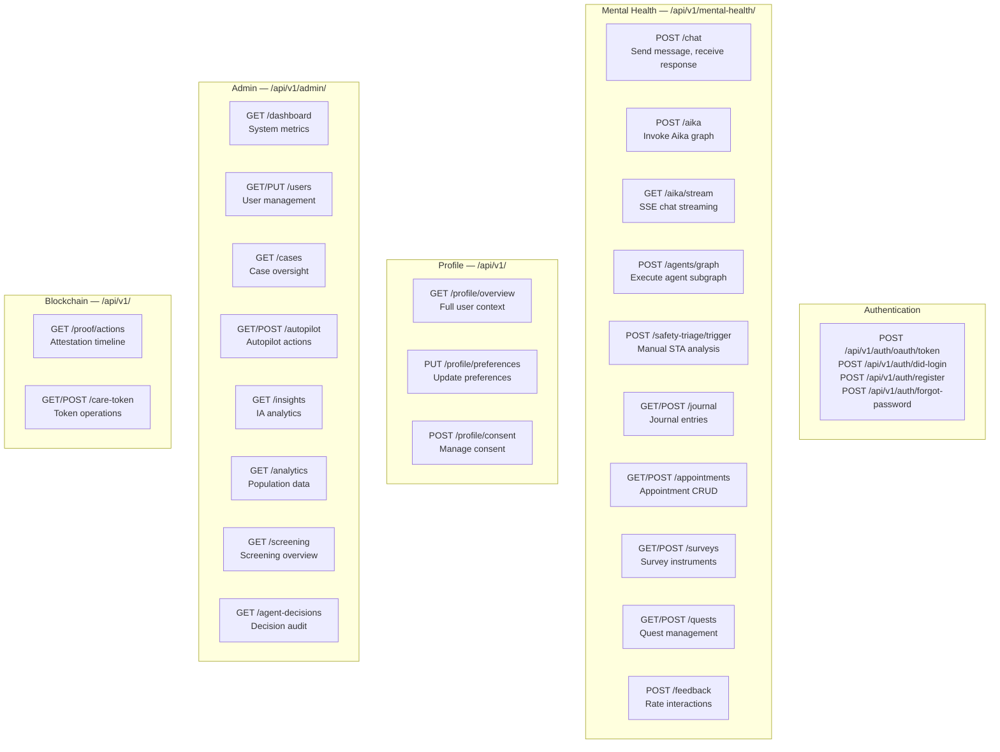
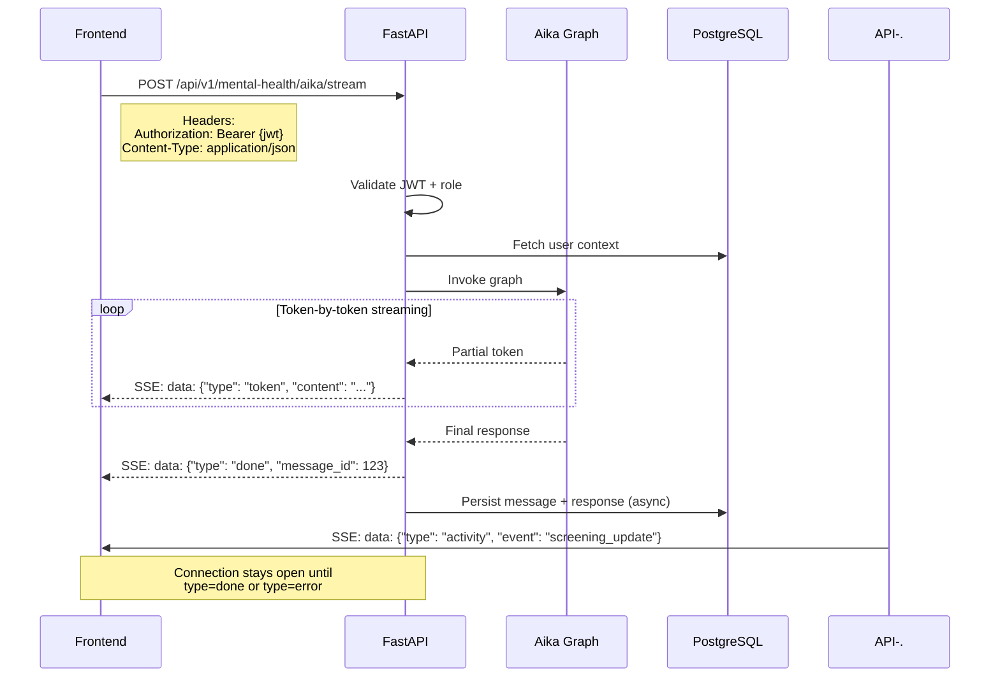

# API Data Contracts

This document describes the key API interactions, request/response shapes, and streaming contracts for the UGM-AICare backend.

---

## API Route Structure



---

## Chat Streaming Contract (SSE)

The primary interaction pattern for student chat uses Server-Sent Events.



### SSE Event Types

| Event Type | Payload | Description |
|-----------|---------|-------------|
| `token` | `{ "type": "token", "content": "word" }` | Individual response tokens |
| `done` | `{ "type": "done", "message_id": int }` | Response complete |
| `error` | `{ "type": "error", "message": "..." }` | Error during generation |
| `activity` | `{ "type": "activity", "event": "..." }` | Background event notification |
| `tool_call` | `{ "type": "tool_call", "tool": "..." }` | Agent executing a tool |

---

## Standard Error Response

All API errors follow a consistent shape:

```json
{
  "detail": {
    "code": "RATE_LIMIT_EXCEEDED",
    "message": "Rate limit exceeded. Retry after 60 seconds.",
    "status": 429
  }
}
```

### Error Codes

| Code | HTTP Status | Description |
|------|------------|-------------|
| `UNAUTHORIZED` | 401 | Invalid or missing JWT |
| `FORBIDDEN` | 403 | Insufficient role permissions |
| `NOT_FOUND` | 404 | Resource not found |
| `RATE_LIMIT_EXCEEDED` | 429 | Too many requests |
| `VALIDATION_ERROR` | 422 | Request body validation failed |
| `LLM_ERROR` | 502 | LLM provider returned an error |
| `LLM_RATE_LIMIT` | 503 | LLM provider rate limit hit |
| `INTERNAL_ERROR` | 500 | Unexpected server error |

---

## Rate Limits

| Endpoint Group | Limit | Window |
|---------------|-------|--------|
| Chat (`/aika`, `/chat`) | 20 requests | Per minute per user |
| Auth (`/auth/*`) | 5 requests | Per minute per IP |
| Admin (`/admin/*`) | 60 requests | Per minute per user |
| STA manual trigger | 3 requests | Per minute per user |
| General API | 100 requests | Per minute per user |

---

## Authentication Headers

All authenticated requests require one of:

```
Authorization: Bearer <jwt_access_token>
Cookie: access_token=<jwt_access_token>; HttpOnly; Secure; SameSite=Lax
```

### JWT Payload

```json
{
  "sub": "user_id",
  "email": "student@ugm.ac.id",
  "role": "student",
  "exp": 1740000000,
  "iat": 1739996400,
  "type": "access"
}
```
