# Technology Stack — Layered Architecture

This document presents the UGM-AICare technology stack organized as a layered architecture, showing which technologies operate at each layer and how they communicate.

---

## Layered Architecture Diagram

```mermaid
graph TB
    subgraph "Layer 1: Presentation"
        direction LR
        NEXT["Next.js 16<br/>TypeScript 5<br/>Tailwind CSS 4<br/>Framer Motion"]
        AUTH_FE["NextAuth.js v5<br/>Session management"]
        WEB3["wagmi + RainbowKit<br/>Wallet connections"]
        SSE_FE["SSE Client<br/>Real-time streaming"]
    end

    subgraph "Layer 2: API Gateway"
        direction LR
        FAST["FastAPI<br/>Python 3.9+"]
        PYDANTIC["Pydantic v2<br/>Request validation"]
        JWT["python-jose<br/>JWT authentication"]
        PROM["prometheus-fastapi<br/>Metrics collection"]
    end

    subgraph "Layer 3: Agent Orchestration"
        direction LR
        LG["LangGraph<br/>StateGraph + Conditional Edges"]
        TOOLS["Tool Registry<br/>@register_tool decorator"]
        CHECK["AsyncPostgresSaver<br/>Graph checkpointing"]
        TRACK["Execution Tracker<br/>Node-level telemetry"]
    end

    subgraph "Layer 4: Intelligence"
        direction LR
        GEM["Google Gemini 2.5<br/>Primary LLM"]
        FLASH["Gemini Flash<br/>Fast responses"]
        PRO["Gemini Pro<br/>Complex reasoning"]
        ZAI["Z.AI / OpenRouter<br/>Fallback providers"]
        LF["Langfuse<br/>LLM observability"]
    end

    subgraph "Layer 5: Domain Services"
        direction LR
        MH["Mental Health Domain<br/>Chat, Screening, Cases"]
        BLK["Blockchain Domain<br/>Tokens, NFTs, Attestation"]
        FIN["Finance Domain<br/>Revenue, Staking"]
        USR["User Domain<br/>Auth, Profiles, Preferences"]
    end

    subgraph "Layer 6: Data & Infrastructure"
        direction LR
        PG["PostgreSQL<br/>Primary data store<br/>+ Alembic migrations"]
        RED["Redis<br/>Cache + Rate limiting"]
        OBJ["S3-Compatible Storage<br/>Avatars, media"]
        SCHED["APScheduler<br/>Background jobs"]
        DOCKER["Docker Compose<br/>Container orchestration"]
        NGINX["Nginx<br/>Reverse proxy + SSL"]
    end

    subgraph "Layer 7: Blockchain"
        direction LR
        SOMNIA["SOMNIA Chain<br/>CARE Token + Staking"]
        EDU["EDU Chain<br/>NFT Achievement Badges"]
        BNB["BNB Smart Chain<br/>NFT Badges (alternate)"]
        WEB3PY["web3.py<br/>Blockchain client"]
        OZ["OpenZeppelin<br/>Smart contract libraries"]
    end

    NEXT --> FAST
    AUTH_FE --> FAST
    SSE_FE --> FAST
    WEB3 --> FAST

    FAST --> LG
    PYDANTIC --> FAST
    JWT --> FAST
    PROM --> FAST

    LG --> GEM & FLASH & PRO
    LG --> ZAI
    LG --> LF

    FAST --> MH & BLK & FIN & USR

    MH --> PG & RED
    BLK --> SOMNIA & EDU & BNB
    BLK --> WEB3PY & OZ

    FAST --> DOCKER --> NGINX
    FAST --> SCHED

    style GEM fill:#4285f4,color:#fff
    style PG fill:#336791,color:#fff
    style RED fill:#dc382d,color:#fff
    style SOMNIA fill:#8b5cf6,color:#fff
```

---

## Technology Selection Rationale

### Why LangGraph?

| Considered | Why Not |
|------------|---------|
| Raw LangChain | Too high-level; insufficient control over graph topology and state |
| Custom state machine | Reinventing graph execution, checkpointing, and observability |
| **LangGraph** | **Direct graph control, native checkpointing, conditional edges, and Langfuse integration** |

### Why Gemini?

| Considered | Why Not |
|------------|---------|
| OpenAI GPT-4 | Higher cost per token; less support for Indonesian language |
| Claude | Good quality but limited function-calling support at time of design |
| **Gemini 2.5** | **Strong multilingual support (Bahasa Indonesia), function calling, competitive pricing, fast inference** |

### Why FastAPI?

| Considered | Why Not |
|------------|---------|
| Django | Too heavy; ORM coupling makes agent layer integration harder |
| Flask | Lacks native async support needed for SSE streaming |
| **FastAPI** | **Native async, Pydantic validation, automatic OpenAPI docs, high performance** |

### Why PostgreSQL?

| Considered | Why Not |
|------------|---------|
| MongoDB | Agent state benefits from relational integrity and transactional guarantees |
| SQLite | No concurrent access support for production |
| **PostgreSQL** | **ACID compliance, JSONB for flexible fields, LangGraph checkpointing support, proven at scale** |

---

## Version Matrix

| Technology | Version | Purpose |
|------------|---------|---------|
| Next.js | 16.0.7 | Frontend framework |
| TypeScript | 5.x | Frontend type safety |
| Tailwind CSS | 4.x | Utility-first styling |
| Python | 3.9+ | Backend runtime |
| FastAPI | Latest | API framework |
| SQLAlchemy | 2.0 | Async ORM |
| Alembic | Latest | Database migrations |
| Pydantic | v2 | Data validation |
| LangGraph | Latest | Agent orchestration |
| Google Gemini | 2.5 | Primary LLM |
| PostgreSQL | 15+ | Primary database |
| Redis | 7+ | Caching + rate limiting |
| Docker | 24+ | Container runtime |
| Node.js | 18+ | Frontend runtime |
