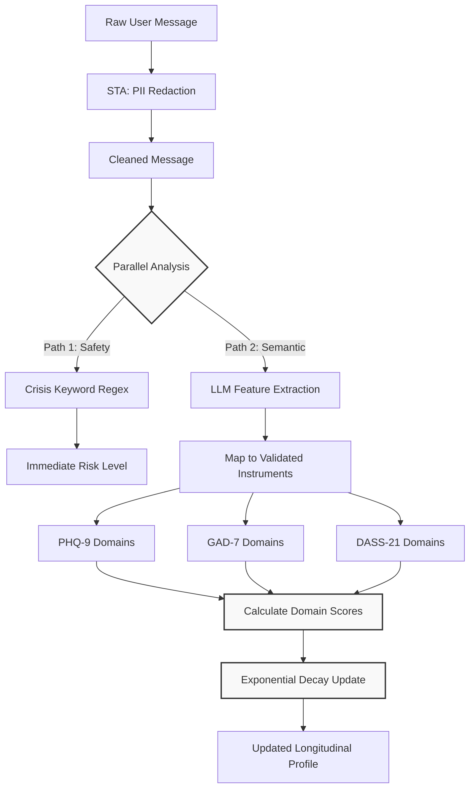

# Covert Mental Health Screening

UGM-AICare implements a continuous, covert mental health screening system that passively extracts psychological indicators from natural conversations. By evaluating users implicitly during normal interactions, the system mitigates social desirability bias and captures authentic emotional states.

## The Text-to-Score Pipeline

The screening process is integrated directly into the Safety Triage Agent (STA) workflow. Every incoming user message undergoes a dual-analysis process: immediate risk assessment for safety, and longitudinal screening extraction.

## Longitudinal Tracking Mechanics

Mental health states fluctuate over time. To account for this, the screening engine does not rely solely on the most recent conversation. Instead, it maintains a longitudinal profile using an exponential decay formula.

`New Score = (Old Score × Decay Factor) + (Extracted Weight × Update Factor)`

Where:

- **Decay Factor (e.g., 0.95):** Ensures historical data slowly diminishes in influence, allowing recent indicators to be weighted more heavily.
- **Update Factor:** Determines the impact of the current conversation on the overall score.

This approach ensures the system accurately reflects a student's current mental state while retaining context regarding their historical baseline.
