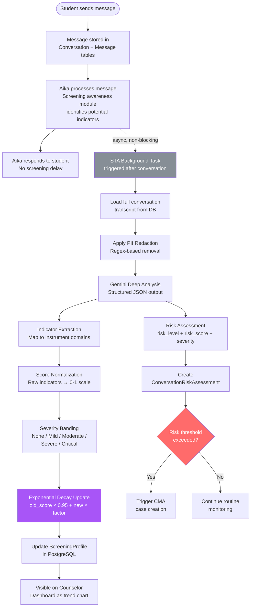
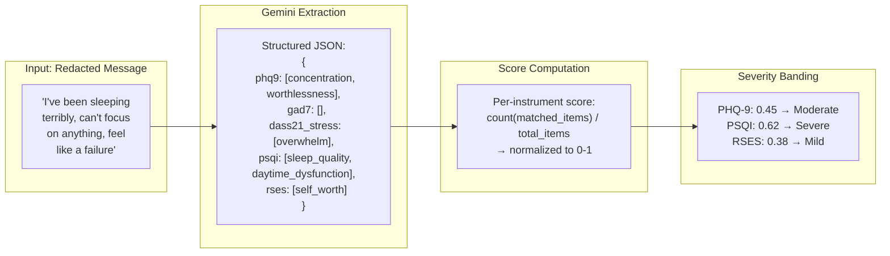
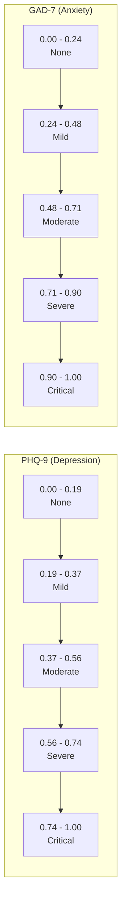
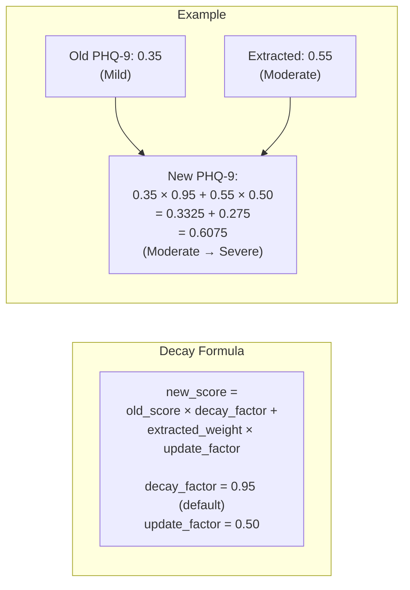
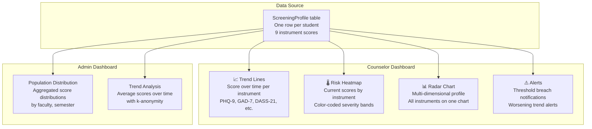

# Covert Screening Pipeline

This document details the end-to-end covert screening pipeline — from raw conversation messages through indicator extraction, score normalization, longitudinal profile updates, and dashboard visualization.

---

## Pipeline Overview

---

## Indicator Extraction

The STA extracts psychological indicators from redacted conversation text and maps them to validated instrument domains.

---

## Score Normalization & Severity Bands

Each instrument uses specific thresholds normalized to a 0-1 scale:

| Instrument | None | Mild | Moderate | Severe | Critical |
|------------|------|------|----------|--------|----------|
| PHQ-9 | 0 - 0.19 | 0.19 - 0.37 | 0.37 - 0.56 | 0.56 - 0.74 | 0.74 - 1.0 |
| GAD-7 | 0 - 0.24 | 0.24 - 0.48 | 0.48 - 0.71 | 0.71 - 0.90 | 0.90 - 1.0 |
| DASS-21 Stress | 0 - 0.19 | 0.19 - 0.29 | 0.29 - 0.38 | 0.38 - 0.60 | 0.60 - 1.0 |
| PSQI | 0 - 0.20 | 0.20 - 0.40 | 0.40 - 0.60 | 0.60 - 0.80 | 0.80 - 1.0 |
| UCLA Loneliness | 0 - 0.20 | 0.20 - 0.40 | 0.40 - 0.60 | 0.60 - 0.80 | 0.80 - 1.0 |
| RSES | 0 - 0.20 | 0.20 - 0.40 | 0.40 - 0.60 | 0.60 - 0.80 | 0.80 - 1.0 |
| C-SSRS | 0 - 0.00 | N/A | N/A | 0.01 - 0.50 | 0.50 - 1.0 |

---

## Longitudinal Decay Model

The screening profile is updated with exponential decay to weight recent indicators more heavily:

### Decay Properties

| Property | Value | Rationale |
|----------|-------|-----------|
| `decay_factor` | 0.95 | 5% decay per conversation — gradual forgetting |
| `update_factor` | 0.50 | New evidence has significant but not overwhelming weight |
| Minimum update interval | Per conversation | Prevents rapid oscillation |
| Score bounds | [0.0, 1.0] | Clamped to valid range |

---

## Screening Dashboard Visualization

---

## Validated Instruments Reference

| Instrument | Full Name | Domains | Items | Reference |
|------------|-----------|---------|-------|-----------|
| PHQ-9 | Patient Health Questionnaire-9 | Depression | 9 | Kroenke et al. (2001) |
| GAD-7 | Generalized Anxiety Disorder-7 | Anxiety | 7 | Spitzer et al. (2006) |
| DASS-21 | Depression Anxiety Stress Scales | Depression, Anxiety, Stress | 21 | Lovibond & Lovibond (1995) |
| PSQI | Pittsburgh Sleep Quality Index | Sleep Quality | 19 (7 components) | Buysse et al. (1989) |
| UCLA-3 | UCLA Loneliness Scale v3 | Social Isolation | 20 | Russell (1996) |
| RSES | Rosenberg Self-Esteem Scale | Self-Esteem | 10 | Rosenberg (1965) |
| C-SSRS | Columbia Suicide Severity Rating | Suicidality | 6 | Posner et al. (2011) |
| AUDIT | Alcohol Use Disorders ID | Substance Use | 10 | Saunders et al. (1993) |
| SSI | Student Stress Inventory | Academic Stress | Adapted | Lakaev (2009) |
