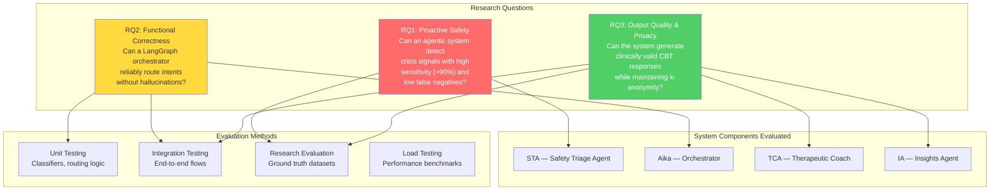
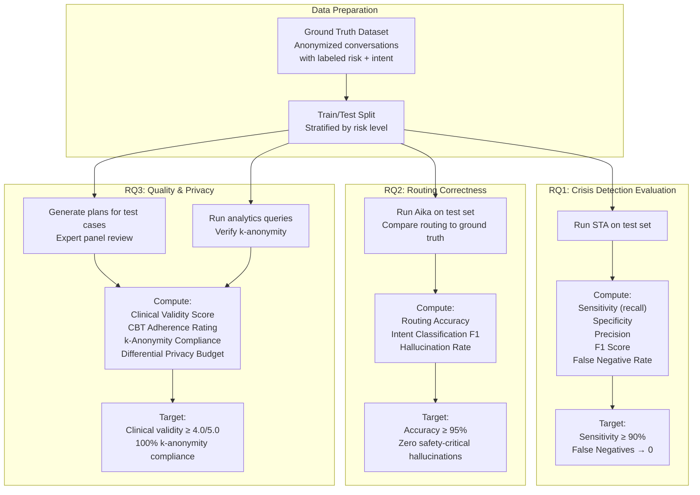
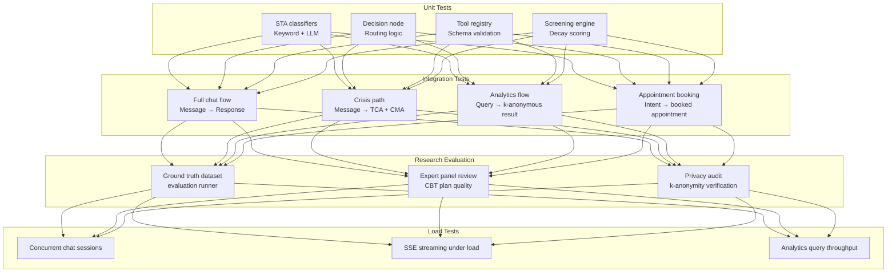

# Research Evaluation Framework

This document maps the three research questions to system components, evaluation methods, and measurable metrics.

---

## Research Questions to System Mapping

---

## Evaluation Pipeline

---

## Metrics Dashboard

### RQ1 — Crisis Detection Metrics

| Metric | Formula | Target |
|--------|---------|--------|
| Sensitivity (Recall) | TP / (TP + FN) | ≥ 0.90 |
| Specificity | TN / (TN + FP) | ≥ 0.85 |
| Precision | TP / (TP + FP) | ≥ 0.80 |
| F1 Score | 2 × (P × R) / (P + R) | ≥ 0.85 |
| False Negative Rate | FN / (TP + FN) | ≤ 0.10 |
| Latency (Tier 1) | Keyword scan time | < 5ms |
| Latency (Tier 2) | LLM classification time | < 500ms |

### RQ2 — Routing Correctness Metrics

| Metric | Formula | Target |
|--------|---------|--------|
| Routing Accuracy | Correct routes / Total | ≥ 0.95 |
| Intent F1 | Per-class F1 macro-average | ≥ 0.90 |
| Safety-Critical Hallucinations | Incorrect HIGH→LOW routing | 0 |
| Small-Talk Precision | Correct skips / Total skips | ≥ 0.95 |
| Tool Call Accuracy | Correct tool invocations / Total | ≥ 0.90 |

### RQ3 — Quality & Privacy Metrics

| Metric | Method | Target |
|--------|--------|--------|
| Clinical Validity | Expert panel rating (1-5) | ≥ 4.0 |
| CBT Adherence | Checklist compliance | ≥ 90% |
| Personalization | Novel strategies / Total | ≥ 80% |
| k-Anonymity Compliance | Cell count audit | 100% cells ≥ 5 |
| DP Budget | ε tracking per query | Within allocated ε |
| Privacy Attack Resistance | Re-identification attempts | 0 successful |

---

## Testing Strategy

